# 2026-09-30: rework the board placement and fix more power stuff

**Total time spent: 5 hours**

i stopped trying to keep everything on top and did a much bigger placement pass across all three main boards. i moved 230 existing parts on the center board and reorganized the USB, audio, MCU and power sections. small support parts now use the underside where it makes sense, with capacitors much closer to the pins they actually support. the connectors, mounting holes and existing PCIe routing stayed in place.
i also integrated the revised 100 W power circuit, corrected the charger current limits and standby-current handling, added missing bypass capacitors, and made a proper footprint for the power MOSFETs. i checked the maximum heights of all 392 underside parts and exported their positions for the case design. the BMS manufacturing package was regenerated and checked too.
the schematics and board connections match, both I/O boards have zero physical DRC errors, and the firmware passes all 34 host tests and its ARM build. the center board still has routing errors to fix.

images: 

# 2026-09-29: work on standby power and update the pd configs

**Total time spent: 3 hours**

worked on the 100 W power redesign, mainly the standby supply and Mu regulator. added controlled startup and current limiting to the standby circuit, and changed its battery feed so that current goes through the charger’s measurement shunt. checked component tolerances and corrected several resistor ordering codes. the Mu supply now has two current-sense resistors in parallel, and i adjusted its power budget to leave enough room for the fan.
also exported fresh 20 V / 5 A configurations for both USB-C controllers and checked the generated files. corrected the BMS shunt part number and rebuilt its assembly package without changing the routing. the firmware tests and ARM build pass. main-board placement is still unfinished, especially around the charger’s gate-drive and bootstrap parts, so those changes haven’t been applied to the saved main boards yet. no new routing was added.
image: 

# 2026-09-29: more keyboard routing

**Total time spent: 22 minutes**

did some keyboard routing! rerouted the updated led signals and power stuff.
this was done yesterday, just forgot to devlog
image: 

[lapse](https://lapse.hackclub.com/timelapse/cNIGQ1WzACUJ)

# 2026-09-28: finish the bms routing and clean up the tracks

**Total time spent: 2 hours**

finished the bms routing after the connector and fuse changes, then cleaned up the weird bends and dangling tracks across the board. merged the tiny straight segments, removed unused vias, and replaced the old battery connector tail with a shorter connection. there are now 628 fewer track segments, without moving any components or mounting holes.
fixed the supervisor ground return and current-sense pickup, checked all nine power paths, moved nine clipped labels and removed the last copper sliver. the saved board now has zero unconnected items, physical drc errors, dangling-copper warnings or silkscreen warnings. the pad and drill checks pass too. updated the layout report and readme, and pushed everything. the pcbway files still need regenerating for this revision before ordering.

# 2026-09-27: sort out the keyboard leds and fix more bms routing

**Total time spent: 4 hours**

the keyboard led wiring was crossing everywhere, so i changed the assignments to follow the actual rows and nearby columns. updated the schematic, pcb, firmware mapping and wiring reference together. kept all 65 local led joins, all 264 vias and the existing switch, power and i2c routing. only removed or trimmed old led links that conflicted with the new assignments. the mapping tests pass, and the keyboard still has four existing ground thermal errors to fix while routing.
also continued repairing the bms around the connector changes. brought it from 85 unconnected items down to 5, restored more control and power connections, and extended the pours into the unused space near the edges. moved and shrank the current-sense test point and removed several vias that were cutting through the main power copper. compared the power paths against the previous board and checked each saved revision. the latest bms has zero physical drc errors, but still needs the last connections and final checks on the sensing and return paths before it is ready to order.

# 2026-09-26: work on the power redesign and case

**Total time spent: 6 hours**

worked on the 100w power redesign for the mu ultra. added the ISL9241 charger driver, input switching and interlocks, and more current-limit and power-budget handling. the firmware tests cover weaker chargers, switching inputs, resets, failed communication and charging independently of the os. also worked on the new Mu supply and always-on power circuits. the complete 100w circuit still needs to be integrated into the boards.
changed the tall power connectors to low-profile WAGO terminals and updated the wire specifications and shared return-current calculations. the BMS now has a right-angle raw-pack connector and a smaller 5a fuse. fitting everything meant moving some nearby parts and test points, then removing conflicting copper. the board outlines, mounting holes and existing main-board high-speed routing were preserved. the BMS currently has 85 connections left to repair, so it isn't ready to order again yet.
expanded the case study into a full assembly with base and lid pieces, revised Framework hinge supports, keyboard and trackpad supports, battery trays, speaker and OLED mounts, and cooling reservations. added STEP/STL exports, mounting and fastener schedules, an interactive viewer, and open, closed, exploded and section views. the study exposed how much space the old plugs and wire bends needed. the final thickness is still undecided, and the case exports need updating for the revised connectors.
the firmware host tests and all 19 power tests pass. all four updated schematics have zero ERC errors and match their PCB pin assignments. saved everything as a checkpoint and marked the previous BMS manufacturing files as outdated. routing, harness clearance and physical testing still need finishing.

# 2026-09-26: start the case with the actual hinge mounts

**Total time spent: 1 hour**

imported the original Framework 13 hinge models and revision-00 drawings. the left and right mounts are different: their base seating faces are 1.3 and 2.2 mm below the shared axis. the lid has stepped faces too. made separate backing plates, spacers and small printed fit gauges for both sides. the editable source, STEP files, STLs and dimensioned mount drawings are together in mechanical/case-prototype.
the replacement photos were useful here. the three lid screws are two M2 screws and one smaller M1.6 screw. the extra large hole is part of the Framework display mounting arrangement. the two base screws use the middle round and slotted holes, not the outer locating holes. the new plates have their own chassis bolts, clear of the hinge screw heads.

# 2026-09-25: fix charging without the os and sort out the mu model

**Total time spent: 2 hours**

fixed the mu ultra model so it sits correctly in the socket, without changing the actual board placement or routing. also fixed the charging logic so it doesn't depend on the OS being running. added checks for charging during startup, shutdown, missing load readings and temperature faults.
expanded the power calculator to account for converter limits and battery assistance. all software tests and the firmware build passed. the bigger 100w power redesign is drafted and saved, but still needs integration and board changes before it's ready.

# 2026-09-24: start switching the carrier to mu ultra

**Total time spent: 1 hour**

started converting the carrier to the mu ultra, with the 226v first and room to upgrade to the 256v later. checked all 260 module contacts, moved the usb connections that changed, and moved hdmi to TCP2. pin 136 used to be ground but is now reserved, so that connection is gone. also replaced the nvme clock-request pull-down with the proper connection to the module.
changed the internal usb hub from two ports to three so the trackpad can share it with the audio codec and optional radio. made the hub footprint match the manufacturer’s drawing and placed the trackpad power-control parts. removed 51 obsolete trace/via items around the changed connections, while keeping the rest of the routing and existing component positions.
the schematic checks and 13 interface tests passed, and both boards’ pad connections match their schematics. there’s still routing and existing DRC issues to finish. decided on 100w usb-c input, but the charger, 12v supply and safe transition to battery power still need redesigning. the bms and keyboard are unchanged.
image: 

# 2026-09-23: keyboard routing

**Total time spent: 1 hour**

did some routing on the keyboard. did the switches, mcu, and led power, but not yet led signal.

[lapse](https://lapse.hackclub.com/timelapse/IrWANT44CM27)

# 2026-09-22: add rgb to the keyboard and get it ready to route

**Total time spent: 3 hours**

added per-key rgb to the keyboard! picked tiny everlight LEDs that fit underneath the cherry ultra low profile switches, then checked their height, pads and position against the switch drawings. added a matrix driver, current-setting resistor, power filtering and an I2C buffer so turning the lighting off won't interfere with the rest of the bus.

finished the schematic and component placement while keeping the original key positions, board outline and cable connector. cleared the previous routing so i can route it again myself. also cleaned up the schematic labels, added a connection map and routing notes, and removed the old non-rgb order files.

the firmware now handles startup, individual colours, brightness and fault shutdown. all 30 firmware tests and the target build passed. the schematic and placement checks are clean, with 960 connections left to route. next up is routing it.

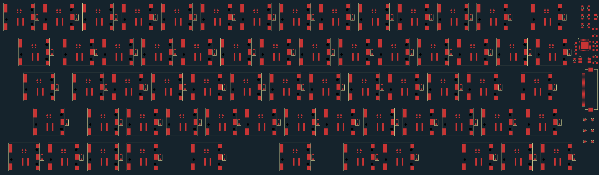

# 2026-09-22: get the bms files ready for pcbway

**Total time spent: 2 hours**

got the bms files ready for a pcbway quote. there were still a few manufacturing details to fix after finishing the routing. widened three short traces from 0.09 to 0.10 mm, thickened the silkscreen to 0.15 mm, and cleaned up the overlap that caused.

also moved six vias away from nearby solder-mask openings. one low-current return via now has a smaller hole while keeping the same copper land. checked the smt openings with an extra 0.05 mm mask margin, then reran the power-path checks to make sure these changes hadn’t broken anything.

exported and checked all four copper layers, drills, stencil files, the electrical test netlist, bom and placement files. the assembly list has 123 smt parts and two through-hole parts, with the removable fuse listed separately. the test pads aren’t counted as components.

the saved board still has zero physical drc errors, zero unconnected items and no schematic mismatches. all 28 power-path cases passed. bundled everything with assembly drawings, order settings and file checksums. the notes ask for prices for one and two assembled boards. i still need to get the parts and manufacturing details confirmed with pcbway before paying.

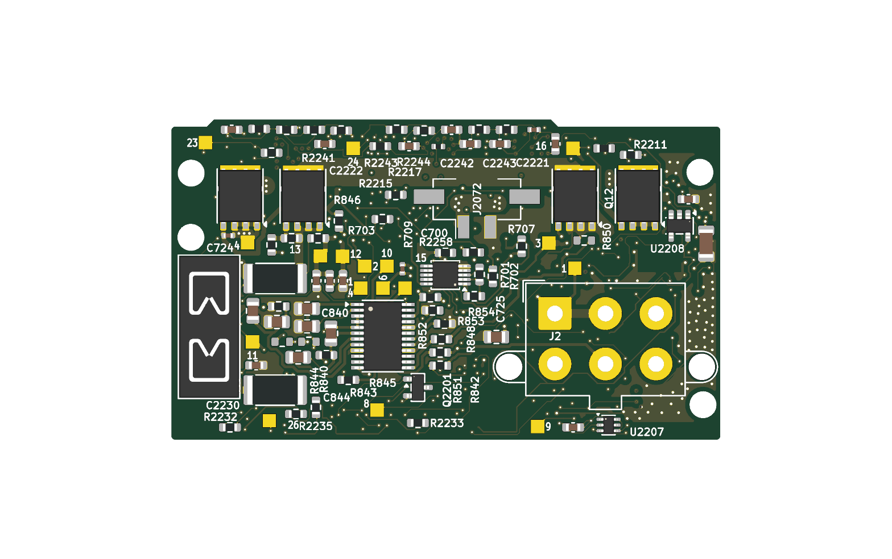
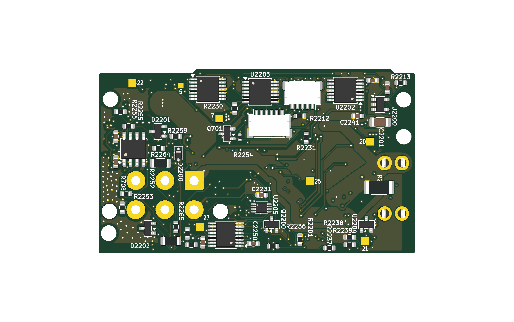

# 2026-09-21: finished bms routing!!

**Total time spent: 4 hours**

finally finished routing the bms! the temperature probes, isolated control signals, reference circuits and remaining supply connections are all connected now. it still fits on four layers. i removed the two middle mounting holes to make room, kept the four outer supports, and moved a few small parts around to get through the cramped areas.

i also reworked some power copper so the signal vias have enough clearance, then checked that the battery and return paths were still connected properly. the quiet sensing return stays separate from the load current. the saved board has zero unconnected items, zero physical drc errors and no schematic mismatches. all 13 thermal tests and 31 electrical calculation checks passed too.

cleaned up the silkscreen and test-point numbers, added front and back assembly drawings, exported previews, and updated the mechanical files and docs. i also wrote down the remaining warnings so i can refer back to them when i get the board made.

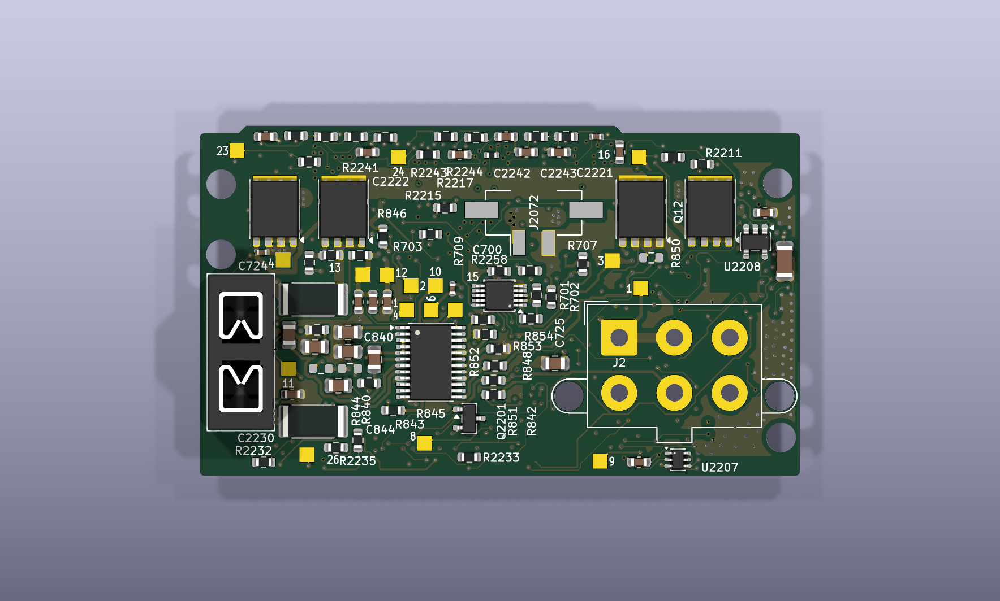
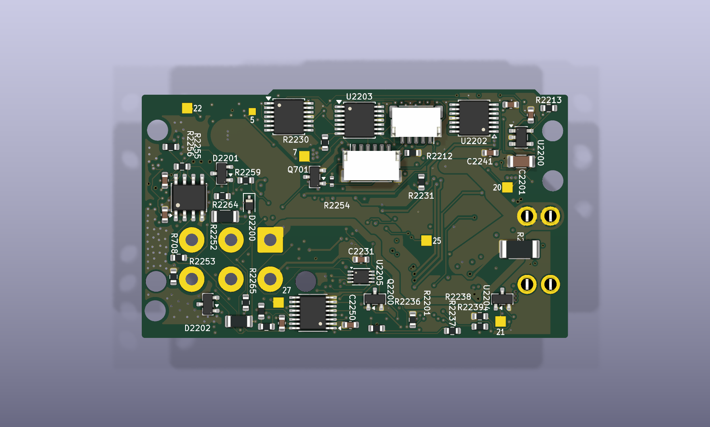

# 2026-09-20: more bms routing

**Total time spent: 5 hours**

spent a lot of time on the bms routing. routed the charge and discharge health signals, hot temperature references, and more of the isolated controls and supplies. also moved a few control and reference components to make room, and restored the complete schematic so it matches the revised 149-part board. it still fits on four layers.

a big part of this was checking what the new traces did to the battery current paths. some routes passed normal drc but narrowed important copper enough to fail the resistance margin checks, so i discarded those versions. the saved board has zero physical drc errors and no schematic-to-pcb mismatches.

i have 46 connections left, mostly the temperature-sense and cold-reference circuits, supply rails, quiet returns and retry signals. i also need to clean up the silkscreen and the leftover track ends as i finish those connections.

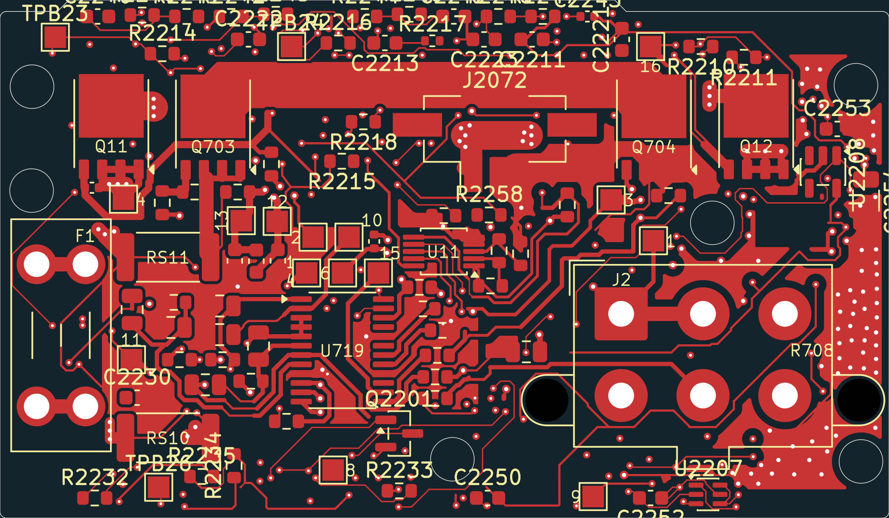

# 2026-09-19: cleaned up schematics

**Total time spent: 4 hours**

cleaned up the schematics across the main board, both i/o boards, bms, keyboard and radio board. a lot of the labels and values were sitting inside large symbols or on top of each other. moved the reference and value text outside the bigger chips, turned net labels outward, and removed duplicate labels sitting on the same pin.

also spread out the crowded charger, efuse, wifi and oled sections, including the small parts that were overlapping the larger symbols. updated the generators so the next regeneration keeps these readability changes, then saved the updated sheets.

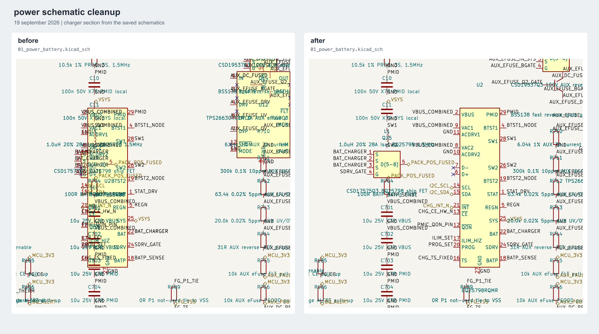

# 2026-09-19: Split up my first 142 hour journal

**Total time spent: 1 hour**

split my first big journal into 40 shorter entries. it covered work from july 2 through august 27, before i knew about forge, and the single long entry was getting hard to read.

i grouped the work into smaller sessions and kept the original dates and individual times. the earlier design, firmware and placement work now has its own entries, instead of everything being buried in one huge list. i also kept the screenshots with the older work.

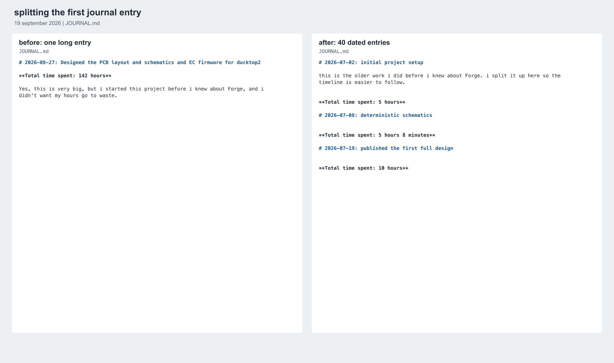

# 2026-09-18: more bms routing

**Total time spent: 1 hour**

worked on the bms thermal and control wiring and added nine connections. it still has 44 unconnected items, with no physical drc errors. also fixed the c2243 and r2254 datasheet links so they survive schematic generation. all 13 thermal tests passed. the generator fixes are committed, and the unfinished routing is saved locally.

# 2026-09-16: more routing: diff pairs + stm32

**Total time spent: 1 hour**

I realized that i did not need to have a whole bunch of grounded stitching vias in between the differential pairs, and i could have just run a ground trace between them, so that's what i did. also did some routing for the stm32, mostly the keyboard nets.
screenshots: 

# 2026-09-16: nextpcb sponsor!

**Total time spent: 10 minutes**

added nextpcb to the repo's sponsors section with their official logo and a link to their site. they're supporting pcb manufacturing and assembly for ducktop2.

# 2026-09-15: more routing

**Total time spent: 1 hour**

routed a lot of differential pairs, including gigabit ethernet and usb3 port, to the lattepanda mu. also did some miscellaneous routing.
i forgot to start my lapse after like 15 minutes, so lapse only shows 50 minutes :(

# 2026-09-14: put a lot of work into the bms and fixed the usb stuff

**Total time spent: 8 hours**

fixed the 42 usb spacing issues on the center board, corrected the m.2 socket and microphone models, and cleaned up stale footprint warnings. i also investigated the missing ground segment. it was an overlapping stub, so removing it hadn't broken the return path.
most of this session went into the bms: temperature interlocks, isolated controls, the reset circuit and ground returns. some routes passed the normal checks but interrupted important copper paths, so i reworked those and compared the current paths before and after. i also checked smaller resistor and capacitor packages and updated their source definitions. the bms routing is still unfinished, so it isn't ready to order yet.

screenshots: 

# 2026-09-13: fix the pcie routing and ground layers

**Total time spent: 4 hours**

reworked the nvme and wifi pcie routing. the fast signals now use F.Cu, In2.Cu and B.Cu, leaving the ground layers clear of signal tracks. when i originally routed this, i put some pcie diff pairs through dedicated ground layers which was bad. moved the tx coupling caps to the back of the board near the m.2 sockets, tightened the pair spacing, rounded sharp bends and matched the complete paths through the capacitors. also finished the reset, wake and clock-request connections and connected the remaining socket grounds.
fixed placement collisions and the maker supply trace that crossed its switching keepout. corrected the ethernet controller's pcie link to the 85 ohm netclass, while keeping its mdi pairs at 100 ohms. added checks for complete pair lengths, local fanouts and spacing further along each trace. all 12 pcie paths pass the layout checks, and all 49 tests passed.
updated the board documentation and assembly coordinates, keeping the 358 mm span and both 1.5 mm board gaps. saved and reopened the board to verify the changes survived correctly. there are still 1,725 unconnected items and 42 usb spacing findings to work through. the full assembly export also needs the existing bms connector mismatch resolved.

screenshots: 

# 2026-09-13: length matched pcie diff pairs

**Total time spent: 30 minutes**

I forgot to do length matching on the pcie differential pairs last time, so i did it now. luckily it wasnt too much work, because kicad has a very helpful tool for this.
screenshot: 

# 2026-09-12: finish wifi routing and do fpc routing

**Total time spent: 1 hour**

i finished the wifi routing, with the leftover stuff that wasnt part of the diff pairs, and the main thing i did now was both io fpc connectors. i routed a fanout of vias, and then i had to put ground lines through them as well, which was hard and annoying. i couldnt put the ground vias on the other side because the spec sheet of the connector says there needs to be a keepout there.
screenshots:

# 2026-09-12: Routed the diff pairs for the nvme

**Total time spent: 1.5 hours**

i routed the differential pairs, 4 total because 4 lanes, of the pcie3 nvme ssd. i had to use some vias for shifting layers, but i did my best to keep everything in their pairs. i also did the gnd stitching of the lattepanda, and added the coupling capacitors for the pcie lanes.
images: 

# 2026-09-11: more routing, more checking

**Total time spent: 1 hour**

did more maker mcu routing, continued the bms thermal and control routing, including a smaller test point to make room for the comparator signals. the first temperature channel repair has passed its local checks, and the cell-monitor connections are being rebuilt around it. the cable now is a compact soldered one for the board seams and bms.

images: 

# 2026-09-11: did some center board routing

**Total time spent: 30 minutes**

I did some routing for the keybaord FFC connector (the 1k resistors), and also some routing for the maker mcu gpio pins.

screenshots: 

# 2026-09-10: did a lot of work, on the center and right board

**Total time spent: 8 hours**

narrowed the center board by 1.5 mm on each side, giving the boards clearance while keeping the overall span at 358 mm. also fixed the placement around the power converters, checked that both M.2 sockets line up with their retainers, and adjusted the front cutout for the revised bms.
corrected hdmi pairs and usb routing on the right board. the radio’s component information now matches the schematics too. another check caught a missing keepout around the microphone opening and 343 duplicated object ids across three boards. fixed those and updated the footprint importer to prevent the same copying issue.
cleaned up more outdated documentation and tightened the board checks. reviewed footprint differences are now tied to the actual saved components, so later changes need another review. all 159 design tests pass, and the left, center, right and radio boards pass their board-level preparation checks.
the mechanical exporter now follows the actual pcb outlines and includes connectors on the underside. this also caught a proposed cable connector sitting beyond the shortened right board, so that placement was rejected. bms routing and the final power-cable fit are still unfinished, and those trials are kept separate from the saved boards.

images:  

# 2026-09-09: left board changes!

**Total time spent: 10 hours**

got the left board’s power changes into the actual kicad project. it now has 325 parts, up from 273, including the revised USB supply, current monitor, fault latch, and permission circuitry. i made room for separate power wiring and the new signal connector while keeping the existing USB routing intact.
also cleaned up the footprint copies and crowded reference labels. the checks compare the actual pads, nets, solder mask, and paste openings, and preserve the deliberate silkscreen edits. the left board has no physical clearance or courtyard errors in the checked version, although there are still a few documented library and package-filter warnings.
spent more time checking the power limits and firmware behavior. the two usbc power controllers now have separate configurations for their actual ports. USB startup allowance is now 5.6 A, with 5.5 A steady, and losing the system supply leaves the USB power fault latched until it can be cleared safely. the design/import tests and firmware host tests pass; hardware testing still needs to happen.
fixed an import bug too: chips drawn across multiple schematic units could end up with broken component links on the PCB. those links now survive a normal save. my newer HDMI and USB routing on the right board is saved as well. the remaining center, right, and BMS revisions still need integration and checking, so there’s more to do before routing readiness or ordering boards.

image: 

# 2026-09-09: started on the hdmi routing

**Total time spent: 30 minutes**

i did some hdmi routing. only the front layer to start. mostly all resistors/capacitors/diodes done, and ground planes.

images: 

# 2026-09-08: fixed a whole bunch of stuff from an audit

**Total time spent: 15 hours**

spent this stretch working through a project audit. there were a lot of problems across the power circuits, component choices, firmware, and board layout, so this turned into a pretty extensive fix. fixed incorrect resistor part numbers, capacitor packages, the rtc diode orientation, and usb protection connections. also corrected the rp2350 regulator placement and its copper keepouts using the reference design.
the keyboard repairs are finished and its manufacturing files have been rebuilt. checked the switch copper exclusions, mounting pads, paste openings, drill files, and component positions. the checked keyboard has zero drc errors and zero unconnected items. the radio board’s antenna connectors also now line up with the actual mounting geometry.
on the firmware side, fixed the charger’s byte order and worked through the startup, register, watchdog, and fan handling problems. added checks around those paths and continued the usb power controls so port permissions account for available power, startup current, and vconn. physical testing is still ahead.
spent quite a bit of time on the connections between boards too. the revised design separates power wiring from the signal cables. found lower-profile shielded cable connectors, built their footprints from the manufacturer drawings, and remapped the signals with ground guards around the high-speed pairs. cable bends, ground straps, and the complete channel still need checking before those changes are applied.
the bms is still being reworked. a power-path check caught new signal routing breaking up the main battery return plane in the test layout. that version has not been applied. the return path needs to stay wide and continuous while the temperature sensing and isolated controls are added.
also moved several connectors and both m.2 sockets to positions that make more sense for the laptop. those positions are saved now, but the card supports, cable access, and nearby components still need another fit check. the remaining main-board routing hasn’t started.

images: 

# 2026-09-07: fixed a whole bunch of stuff to prepare for center board routing

**Total time spent: 7 hours**

i finished a big preparation pass on the main boards for before routing. i added a rounded cutout at the front center of the main pcb for the bms, with 1.5 mm clearance around it. this keeps the bms out of the middle battery cell’s space. i moved the battery connector to face it and checked that all 30 cable contacts line up with the correct reversed pin mapping.
the placement review uncovered several problems that would have been bad to find later. both m.2 sockets faced away from their mounting nuts, and some power components, the boot button, and the programming connector occupied the card areas. i fixed the socket positions using the reference carrier’s mounting dimensions and added the full card outlines to their courtyards so future placement checks catch overlaps.
i also regrouped the regulator capacitors, feedback networks, inductors, crystals, and battery-gauge parts. several were much too far from their circuits. two usb coupling capacitors had 100pF part numbers despite being labelled 100nF, and another capacitor had a mismatched capacitance and part number. fixed that.
the remaining work included cleaning up reference labels, restoring 18 connector mounting-pad grounds, fixing usb net names so kicad recognizes the differential pairs, and replacing obsolete routing keepouts. i also fixed an editing-tool bug that removed component models during rotation.
all 5,197 checked pads match their schematics, all 27 regression tests pass, and all 67 (shush) electrical calculations pass. the center board is clean apart from its 2,038 airwires. i preserved the existing left-board and bms copper. routing is next, including correcting the left board’s existing usb widths and spacing.

layout diagram: 

# 2026-09-06: changed oled connections, doing more stuff to make the routing ready

**Total time spent: 1 hour**

switched both oleds to wired connectors and moved the maker header beside the mu. fixed the copper-edge errors, cleaned up 37 placements, and tested the layer rules. center board drc is down from 158 to 61 errors; routing still needs doing.

# 2026-09-06: did more stuff to prepare for center board routing

**Total time spent: 1.5 hours**

fixed the center board checks and documented what still needs work. corrected the board selection, net-name parsing, selector pin review, and test-point generation. added 20 regression tests.

diagram showing clearance violations: 

# 2026-09-05: finish bms routing

**Total time spent: 5 hours**

finished the 4-layer bms routing. fixed the shunt sense paths and battery references, widened the power routes, and improved fpc current sharing. cleaned up the silkscreen, updated the docs, and regenerated the board exports. drc and erc both have zero errors and warnings.

this took a lot of time because i already made the board as compact as i could, so i had to squeeze the new stuff in.

screenshots of each layer:

render:

# 2026-09-05: clean up file structure and update documentation

**Total time spent: 1 hour**

i noticed the documentation was getting really outdated, as far as one month, and because i have made so much progress since then, it looks confusing. so, i updated all the documentation, and also cleaned up the file structure because it was messy.
structure image: 

# 2026-09-04: 1/4 PCBs routed: BMS board routed!

**Total time spent: 5 hours**

I routed the BMS board. I kept in mind the trace thicknesses, because a lot of power will go through this. I had 2 uninterrupted ground zones in the inner 2 layers, and another two on the top and bottom. I also added stiching vias. Also there are mounting holes.
Images:   

# 2026-09-03: Finished and prepared the BMS pcb daughterboard for routing, and some other stuff

**Total time spent: 3 hours**

 - i found more than 35 differential pairs with no impedance class across the three i/o boards, the left's hub/usb3 port pairs and the right's hdmi/gbe pairs would have routed at 0.2mm default width. 72 netclass patterns added. same thing on the bms power rails, only the fused positive and pack negative were power_hi: the raw input, post-fuse vin, both fet commons, and the fg_vss return were all default. everything high-current is now power_hi.

 - changed to 4 layer board, with the 2 inner ones being solid fg_vss

 - i wanted to verify individually that the board work before i would plug anything in and fry something, so i added 16 test points

starting routing now

image: 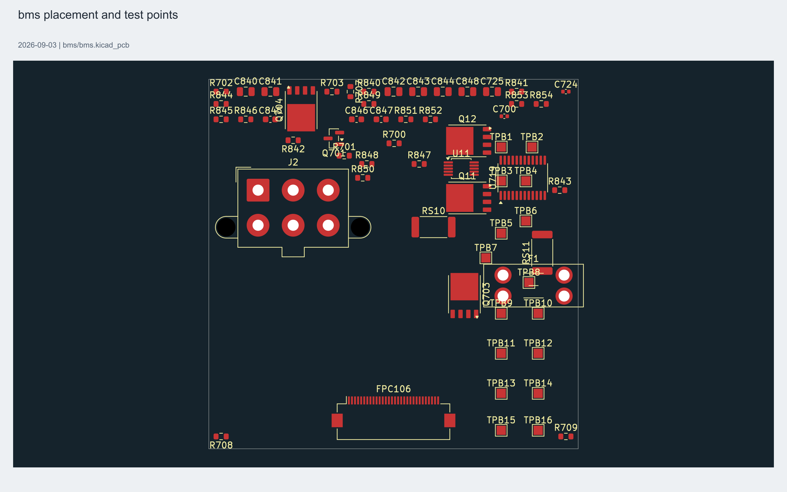

# 2026-09-02: I had someone audit the whole project (big thanks to them, they found a lot of stuff!) and fixed them

**Total time spent: 15 hours**

what the audit found:
- shadow nets: the fpc connector pads carried bare net names (VSYS) while the circuits used prefixed ones (/VSYS). same word, different nets. the battery never reached the charger.
- mirrored cables: a straight ffc between two connectors mounted 180deg apart mirrors the pin order (n <-> 69−n). my boards had straight through maps. fpc3's fused pack positive would have went on gnd. battery had a direct short through the cable.
- both power selectors were dead: the ltc4418 symbol had pins 6 to 10 transcribed from the wrong datasheet column. gnd wired to the intvcc bypass node.
- fh41 shield row 1.25mm off the datasheet, fpc power rails on single pins

right now:
- 4 boards: 0 shorts, 0 clearance, 0 drill/hole · 0 boundary crossings
- 6/6 connectors good
- 0 shadow nets anywhere, ERC 0 x4

images:    

# 2026-08-31: fixed an fpc connector issue

**Total time spent: 5 hours**

i found a problem. the fpc-1 and fpc-2 connectors are a part that doesn't exist. the hirose fh12 series stops at 60 pins, there are no fh12-100s.
i replaced replaced both with the fh41-68s-0.5sh(05). 68 pins, and its a shielded ffc connector so the usb3/hdmi/gbe pairs get a shielded cable, which was the intent anyway. both pin maps are good (fpc-1 uses 1-53, fpc-2 uses 1-61). new footprint derived from kicad's fh41-30s, new 68-pin symbol, solder-hold pads tied to gnd as the shield return, cable spec updated. updated the nets as well.
i also fixed some smaller stuff, like the placement of some components, clearing the shorts and other drc violations.
screenshots:
left io new fpc: 
right io new fpc: 
also updated on the main board: 

# 2026-08-30: wired up fpc connectors

**Total time spent: 5 hours**

every new daughterboards schematic has its hirose connector on it: fpc-1 and fpc-2 are 100-pin, fpc-3 is 30-pin, and all the boundary nets run through them. about to start routing!
image: 

# 2026-08-30: made all .pcb files

**Total time spent: 6 hours**

the main board is now four real .kicad_pcb files: left_io (266 parts), right_io (163), bms (46), ducktop2-center (710). built each from its own schematic so the nets are right, then transplanted the old placement by reference so all the placement keeps.
pcbnew's python wrapper corrupts its own type table after a few hundred by-value returns, so all geometry gets parsed from the board text files instead.
drc: zero shorts on all three daughterboards, zero clearances on bms, all the remaining violations are pre existing footprint level stuff that's also on the original board. center board went from 51 shorts to 17 and none of those involve re placed parts. also generated the FH12-100S footprint (derived from the 50-pin, 100 pads, MP tabs) since kiCad doesn't ship one, and sorted out that kicad-cli resolves project rules from the cwd, which took way too long to figure out.

pcb screenshots:
main board:
left io board: 
right io board: 
bms board: 

# 2026-08-29: center board got cut down

**Total time spent: 1 hour**

the big trim is done. the center board went from 14 sheets to 9: the usb-c i/o sheet, power inputs, hdmi, and ethernet are all gone from it, plus the whole pack-protection section of the power sheet. the center now keeps only whats central: the charger, fuel gauge, and ship fet; the ec and mu; radio; internal services; keyboard; maker; audio. 717 components, down from 1100.
the hard part was the boundary. every net that crosses an fpc now has to exist on the center root as a declared boundary label: 30 to the left board, 35 to the right, plus the pack nets to the bms. and two of them (hub ds1 dp/dm) are pass throughs: they come in on fpc-1 from the left hub and go right back out on fpc-2 to the right board's usb-c port, with nothing on center touching them. the center is just a wire for those.
the verification system had to be rebuilt for four boards. the contract checker now takes a --project flag and runs the right checks against the right netlist, pd1 contracts on the left board, pd2/hdmi/gbe on the right, pack protection on the bms, everything else on center. same for the closure audit and the electrical calculations.
the trim exposed 2 bugs. the daughterboard roots were placing their fpc boundary labels at arbitrary coordinates instead of on the sheet-pin endpoints, so the left and right boards internal wiring never actually connected to their own roots, the netlists showed the pd1 vbus rail as an orphan. and there was a duplicate ground pwrflag sitting on the same spot in the power sheet from my earlier edit, which the erc caught.

image: 

# 2026-08-29: bms board!!

**Total time spent: 1 hour**

the bms board has schematics now. 45 components. the protector filter networks. the bq77915 needs a divider and caps per cell tap, and the ltc4368 needs its uv/ov divider, gate slew network, and the whole fault/retry path.
the board has the fuse, pack connector, both protectors (bq77915 primary + ltc4368 redundant), all four fets, both shunts, and the charge/discharge gate network.the fuel gauge is still on the center board, its i2c and alert lines go to the ec and the source manager, so it's electrically center bound even though it's battery stuff. the charger and ship fet stay center too. what crosses to center is just the pack terminals, fault lines, and 3v3: six nets on fpc-3.
schematic image:

# 2026-08-28: right I/O board!!

**Total time spent: 1 hour**

the right board (right_io/) has pd2 (u42), j11/j12 (already usb2), the hdmi chain, and gigabit ethernet. added to its own schematics and subproject.

schematic screenshots: 

# 2026-08-28: left I/O board!!

**Total time spent: 1 hour**

the left board project exists now. it's a standalone kicad project in left_io/ with its own root schematic and two sheets, holding the hub, the pd1 chain, all five left ports, the usb-a cluster, the ss muxes, and the aux screw terminal — 261 components total.
the aux screw terminal (j190) lives on the left board but its protection chain, fuse, tvs, reverse fet, the whole efuse, stays on center next to the vsys or-ing where it belongs. only the raw AUX_DC_RAW crosses the fpc. second, the left sheets are big because they reuse the main board's full layouts, that's fine for now, a compaction pass can come later.

schematic screenshots: 

# 2026-08-28: starting schematic edits

**Total time spent: 45 minutes**

first schematic edit for the split. the right-side usb-c ports (j11 and j12) are losing their super-speed lanes, because after the split there's no usb3 host port left on that side of the board, the mu has only one usb3 host, and it's feeding the left hub. so j11/j12 keep pd charging (15v sink, 5v/0.9a source) and usb2 data, but their ss pins are now no-connect.
the work was mostly in the generators. j11's port lost its tusb1142 redriver and the whole ss coupling/esd chain. j12 lost its hd3ss6126 orientation mux. the hub's ds1 and ds4 ports became usb2-only, their ss pins (7/8/10/11 and 36/37/39/40) are retired to nc, keeping only the d+/d- pairs that feed the ports' usb2.
net result: 16 ss nets deleted, and the schematic gate is back to pass — closure 1574/0, contracts ok, erc 0, and the pin review table at 2602/2602 all pass.
image: 

# 2026-08-28: connectors picked, cuts validated, boards scaffolded

**Total time spent: 30 minutes**

first, the fpc connectors. the obvious move was to stay in the hirose fh12 family, i already have that for the radio and keyboard (j2300, j310), so one family, one footprint style, one supplier. fpc-1 and fpc-2 get 100-pin versions, fpc-3 gets the same 30-pin part already in the BOM. the important thing i realized is that the impedance for the high-speed pairs is a cable spec, not a connector spec, the fh12 is just a 0.5mm interface, and the 90/100-ohm sections come from ordering impedance-controlled shielded ffc. so the connector decision is boring, which is exactly what you want.
then i validated the cut lines against the actual mechanicals. left cut at x=70 clears the left mounting holes and the hinge notch with 22mm of connector space. right cut at x=300 keeps the right holes and hinge notch with 54mm of space. no hole straddles a cut, which would have been a nightmare for the chassis.
next up is the actual schematic surgery: j11/j12 go usb2-only, the hub and pd1 chain move to the left board, pd2+hdmi+gbe move right, and the bms sheet gets built. that's the real work.
image: 

# 2026-08-28: worked out the specs of the split. 4 boards, 3 fpc connectors.

**Total time spent: 2 hours**

so i spent the last session doing the math on the board split. i built a script that assigns every one of the 1225 footprints to its board — left i/o, center mainboard, right i/o, or the battery bms, and then counted every single net that has to cross a board boundary.
the results surprised me a little:
- fpc-1 (center <->left): 75 signals. usb3 upstream pair to the hub, all the hub control (spi, reset, config), the pd1 i2c and irq lines, plus power.
- fpc-2 (center <-> right): 83 signals. hdmi, gigabit ethernet, the whole pd2 chain, usb2 for j11/j12, ec debug.
- fpc-3 (center <-> bms): 16 signals. just the pack terminals, cell taps, gauge i2c, and the charge/discharge gate lines. this one is beautifully small — it's basically the macbook battery board interface.
- the keyboard ffc stays as it is. the keyboard pcb is already manufactured.
the pd controllers had to be split by function, not by side. pd1 chain goes left with the left ports, pd2 chain goes right with j11/j12. and i confirmed that j11/j12 going usb2-only kills 16 super-speed nets that would have been a nightmare to route across two fpc boundaries.
one thing i didnt do for good reason: no vsys, no vbus_raw, no pphv over any fpc. only sys3v3 and usb_port5v cross, and those are the low-current class. running 8.6a of vsys through an ffc would need like 18 pins and would drop voltage anyway.
the spec is committed and frozen. next is picking the actual ffc connectors, validating the cut lines against the mounting holes, and then the schematic work.
image: 

# 2026-08-28: Big change: splitting the PCB into multiple daughterboards.

**Total time spent: 4 hours**

Big change: splitting the PCB into multiple daughterboards
so this day started with someone from hack club messaging me about my decoupling caps. honestly they were right, i measured pin-to-cap distances in the actual pcb files and it was bad. one of the pd controllers had its 68µf pphv bulk cap sitting ~260mm from the chip, basically the other side of the board. the ldo caps were 30-268mm out. the mu's 12v bulk was ~100mm from the module pins. that's a lot of loop inductance for a 30w part, this would have been a pain to debug on a one-shot board.
but the deeper issue was the layout itself. the usb hub sits at x261 and the ports it feeds are at x4.5 and x353, so every super-speed lane runs 200-300mm across the board just to reach a connector. i looked at splitting into two hubs but the mu only has ONE usb3 host port, so there's no way to feed a second usb3 hub without daisy-chaining (latency) or downgrading.
so i settled on a proper 4-board architecture:
 - left i/o board: 3 usb-c (usb3) + 2 usb-a (usb3) + aux input + the hub + the whole pd controller chain. hub finally sits next to the ports it feeds, and all the decoupling caps become naturally local — the cap fix and the layout fix solve each other.
 - right i/o board: hdmi + gigabit ethernet + 2 usb-c (downgraded to usb2 — the mu has no spare usb3 host port, so they'd have to be usb2 anyway). hdmi and gbe were already on that edge so nothing long crosses.
 - battery bms board: like a macbook — a small board at the pack with the connector, protection fets, current shunts, fuel gauge. only pack terminals + i2c cross to the mainboard. the charger stays on the mainboard because it's the hinge of the whole power tree.
 - center mainboard: mu, m.2, ec, all the converters, battery charger, vsys.
the rule that kept me honest: nothing high-current crosses an fpc. no vsys, no vbus_raw, no pphv. i checked the current math — a full power split would need ~110 ffc pins of power and gnd return at 8.6a, which is just asking for voltage droop and heat. the only things crossing are the hub's one usb3 upstream pair, some i2c and irqs, hdmi/gbe pairs, and pack terminals.
the connectors stay exactly where they are today, the only electrical change is the two right-side usb-c ports become usb2. i'd rather have 5 usb3 ports that are actually good than 7 ports where half are running super-speed lanes across 300mm of fpc.
this is a big layout job — moving the hub and pd chain to the left board, redoing zones for 4 boards, three fpc connectors — but it fixes the actual problems (decoupling, hub fanout, respin cost) instead of papering over them.

mock up of the splits: 

# 2026-08-27: LattePanda MU power and ground routing

**Total time spent: 15 minutes**

wired all the gnd stitching vias to the lattepanda mu, and also the 12 volt net. also routed miscellaneous nets.

# 2026-07-02: initial project setup

**Total time spent: 5 hours**

started putting the ducktop2 design into a proper kicad project. this was the first saved version of the power and battery circuit and the embedded controller, including the generator code i had already been working on before setting up the repo.

the battery circuit at this point used a BQ76920 for the three-cell pack and a BQ25798 charger. i worked through the cell connections, current sensing, charge and discharge controls, and the smaller resistors and capacitors around them. a lot of the setup was getting the symbols, footprints and net labels into a form that could be reused across the project.

on the controller side, i added the STM32F407 and started assigning the keyboard and power-control connections. the power and controller sheets needed to agree on their shared signals, so i kept those connections named consistently and worked through the schematic errors. this gave me a starting project with the two main sheets and their supporting libraries together.

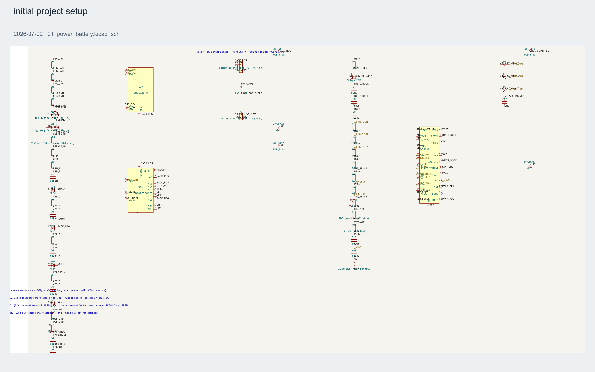

# 2026-07-08: deterministic schematics

**Total time spent: 5 hours 8 minutes**

saved a much more complete set of schematics. the project now included the carrier connections, usb-c, power inputs, hdmi, internal services, display interfaces, keyboard, radio and maker controller. i also brought in the custom symbols and footprints those sections needed, so the sheets could be regenerated together.

one annoying problem was that regenerating the same circuit kept changing the identifiers inside the kicad files. that made the differences huge even when very little had actually changed. i changed the generator to create repeatable identifiers from the sheet context and the order of its objects, instead of making new random ones each time.

that work didn't add another laptop feature, but it made the whole project easier to work on. i could save a schematic change and see the actual difference instead of sorting through hundreds of unrelated identifier changes. the saved set includes the generated sheets, the keyboard board and the library files together.

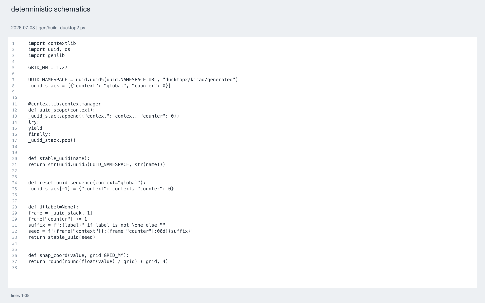

# 2026-07-19: published the first full design

**Total time spent: 10 hours**

put the first full version of ducktop2 together in the public repo. until now, a lot of the work was spread across schematics, generators, board files and separate notes. i brought those into one project with the current hardware design, firmware, drawings and documentation.

the main board was six layers at this point, with its outline and 997 footprints matched to the schematic. it covered the LattePanda Mu, nvme and wifi sockets, usb-c, hdmi, ethernet, power conversion and the embedded controllers. the internal screen uses the Mu's eDP connector, so i documented that connection separately from the external hdmi port. the low-profile keyboard also had its own board and manufacturing files.

i added board renders and an architecture image so the project was understandable without opening every kicad sheet. i also wrote up how the hardware fits together, how to rebuild the schematics, and what the firmware is responsible for. that included the differences from ducktop1, where the separate computer and monitor left cables looping around the outside.

this was mostly about getting all the existing design work into a usable project, with the supporting files alongside it. the board renders show the placement i was working with then, before the later board split.

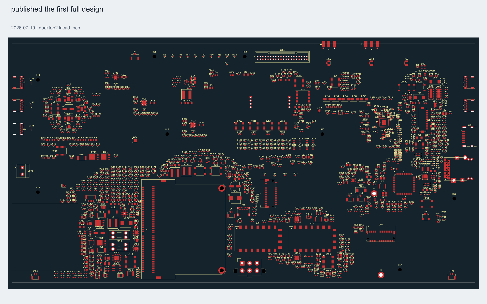

# 2026-07-19: updated the docs and readme

**Total time spent: 22 minutes**

cleaned up the readme and expanded the project documentation after publishing the design. i made the main page explain what ducktop2 is, how it differs from the first version, and where to find the hardware and build information.

i also added the MIT license and removed old pin-review details that no longer belonged in the main readme. the more detailed information stays in the relevant documents, so the front page is easier to read.

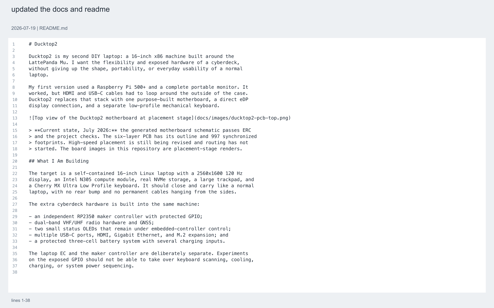

# 2026-07-20: split out the radio hardware and finished the usb-c policy

**Total time spent: 8 hours**

split the radio hardware onto its own removable daughterboard. i wanted the laptop to work normally even if the radio board was missing or needed changing, so the radio could no longer share essential parts of the main system audio path.

the daughterboard now holds the VHF and UHF modules, their filtering and antenna connections, the GNSS receiver and a separate USB audio codec. i kept the normal laptop audio and microphone on the main board. the connections between the boards needed their own power switching and signal controls, including USB, UART, I2C, push-to-talk and status lines. i made those interfaces start with the radio disabled, so an absent board would not affect startup.

i also finished the USB-C port policy. the ports accept 5 V, 9 V or 15 V power at up to 3 A, and can supply 5 V at 900 mA. the laptop uses them as USB host ports. i tied the data-path enable to the controller's role and attachment signals, so the USB connections don't turn on just because a charger is plugged in.

this touched the schematics, the new radio board, firmware and the port configuration files. i updated the documentation alongside those changes so the main-board and daughterboard interfaces stayed understandable.

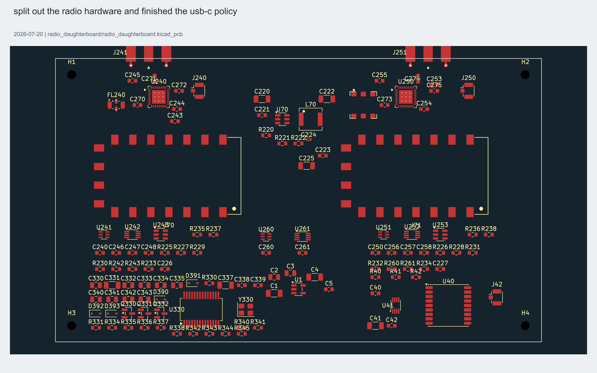

# 2026-07-21: closed the pin reviews and moved the ac coupling caps

**Total time spent: 3 hours 25 minutes**

went through the pin connections again and finished the outstanding pin-by-pin review. i checked how the schematic signals lined up with the actual component pins and the board, rather than relying only on matching part names.

i also moved 23 high-speed coupling capacitors. their positions affect how the pairs can leave the source and reach their connectors, so i worked through the capacitor locations before carrying on with routing. i recorded the placement changes and the reasons for them, then updated the board and the review notes together. this was a cleanup of the existing interface circuits and their layout, with the capacitor positions being the main visible change.

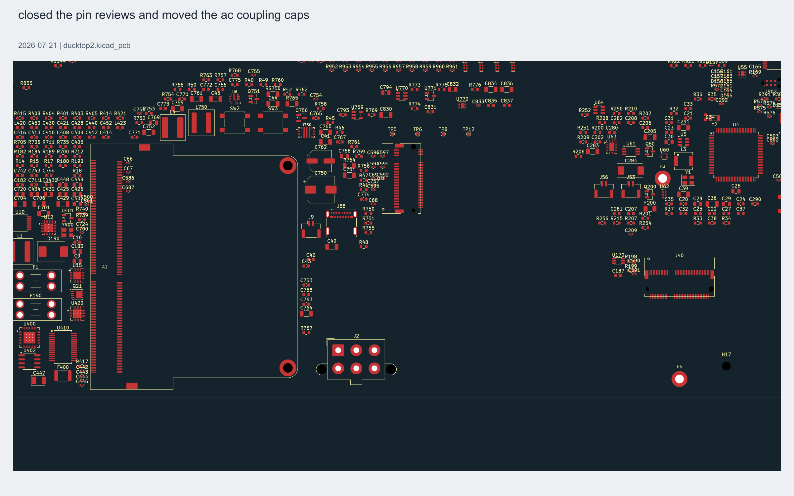

# 2026-07-23: refreshed the published design

**Total time spent: 2 hours**

refreshed the published project with the board changes and new renders. the pictures in the readme needed to match the design i was actually working on, including the main board and the separate daughterboard work.

i also updated the keyboard stencil files and the printing setup for the full-board stencil. that meant keeping the model, process settings and description together instead of leaving the old stencil instructions beside newer files. the repo now showed the current design and the supporting manufacturing work in one place.

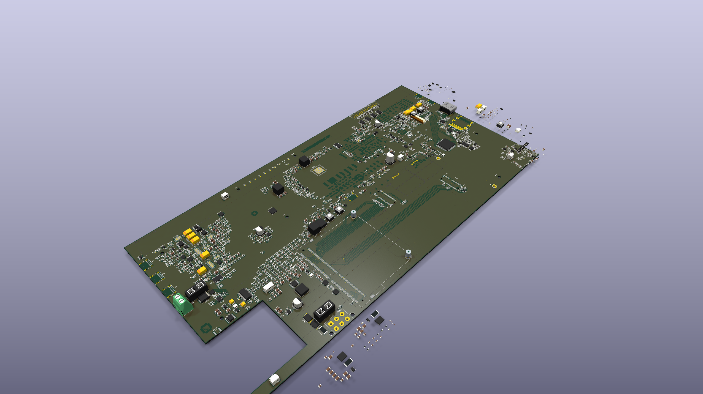

# 2026-07-27: rewired the trackpad over usb2

**Total time spent: 8 hours**

rewired the trackpad to use a direct USB2 connection to the Mu. i worked through the whole connection, including the data pair, series resistors, ESD protection, switched power and the connector pin order. the schematic now describes a four-wire connection with ground, D-, D+ and power.

changing that circuit also meant checking the board that was already there. i found duplicate physical footprints and removed those, then fixed the copper conflict at J58 and the short around the two trackpad series resistors. i had to keep the schematic and PCB in agreement while doing that, because simply changing the labels would have left the old copper attached to the wrong things.

i also checked the surrounding USB and power connections and wrote down the issues i still had to work through. the trackpad's power control needs to agree with the laptop's sleep and shutdown behavior, and the connector must match the actual cable. those details were part of the interface work, not just the two USB signal wires.

the result was a corrected trackpad circuit and a cleanup of the footprint and copper problems exposed by the change. i kept the rest of the board's existing routing and outline while fixing this section.

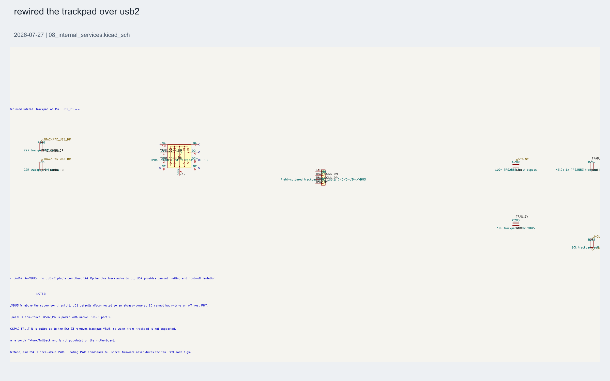

# 2026-07-28: filled in the bom and part numbers

**Total time spent: 2 hours 48 minutes**

worked through the bill of materials and filled in the actual ordering codes. a generic capacitor value or connector name isn't enough when it comes time to buy parts, so i went through the packages and manufacturer part numbers across the sheets.

i assigned 327 missing part numbers on the main design, bringing the list of procurement gaps down from 370 to 43. i also applied the part information to the radio and keyboard boards. while working on the keyboard, i added the Cherry MX ULP switch models so their bodies could be seen in the 3D view. the remaining gaps were kept in a separate list instead of disappearing into the larger BOM.

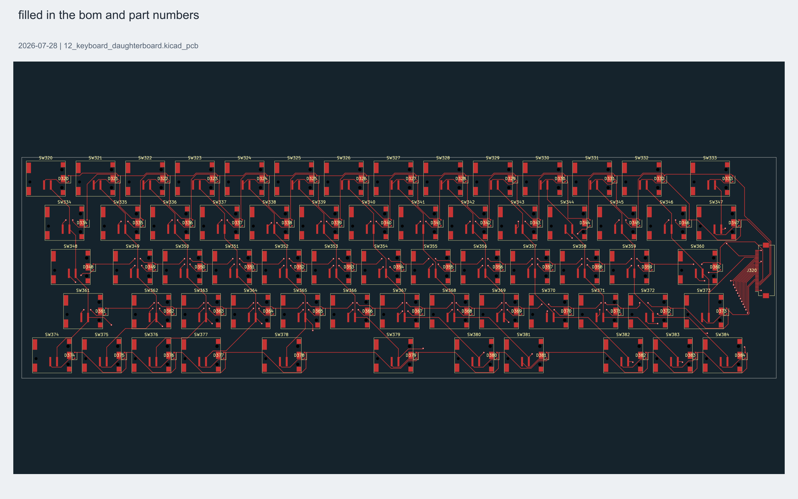

# 2026-07-28: added the remaining 3d models and cleaned up the radio board

**Total time spent: 1 hour 4 minutes**

added more of the missing 3D models, including the M.2 socket and parts on the main and radio boards. i fixed the model paths to use the project directory, so the views could work when the repo was moved to another computer.

i also corrected the side of the radio board's J1 connector. moving that mezzanine connector to the back meant moving its associated fanout and ground stitching too. i relocated the 77 fanout tracks and 42 stitching vias with it, then added the radio-board outline to the main board's drawing layer to show how they fit together.

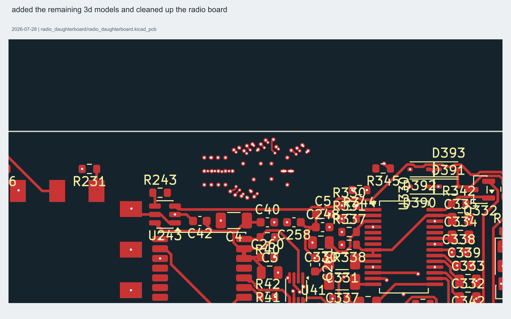

# 2026-07-30: set up the fabrication stackup and ec tooling

**Total time spent: 10 hours**

worked on both the manufacturing setup and the first STM32 target build. i defined the six-layer stackup for NextPCB, then updated the board format and repaired the paths to its 3D models. i also worked on the power-loop placement scripts and the part-number assignments around those circuits.

on the firmware side, i set up the ARM toolchain and brought the embedded-controller code onto the STM32F407 target. that included the startup code, clock setup, millisecond tick, GPIO initialization and I2C driver. the controller needs its pins to start in sensible states before it begins switching power or talking to the other devices, so startup was a substantial part of this work.

the target build produced a firmware binary with the controller loop running at 50 Hz and I2C configured for the service devices. i wrote down the bus addresses and mux channels for the displays, USB-C controllers and other devices so the code and schematic used the same connections.

this session covered a lot of supporting work around the board: its manufacturing definition, model paths, power placement tools and the firmware foundation needed to bring it up later.

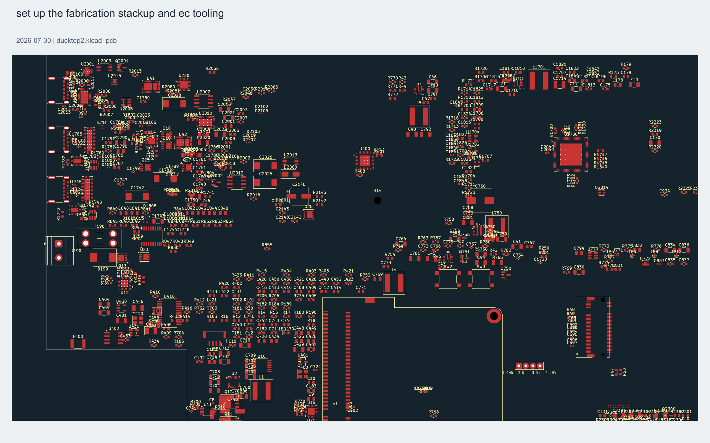

# 2026-07-31: added and fixed the ec dfu path

**Total time spent: 5 hours 30 minutes**

added a way to program the embedded controller over USB. the circuit includes a BOOT0 button and a rear USB-C programming connection, with the USB protection and supporting parts on the internal-services sheet.

i then worked through the schematic errors caused by that addition. some of the references and annotations needed fixing so the programming section could live alongside the existing service circuits without collisions. i kept the programming connection separate from the normal host USB connections and updated the notes to explain how to enter the STM32 bootloader.

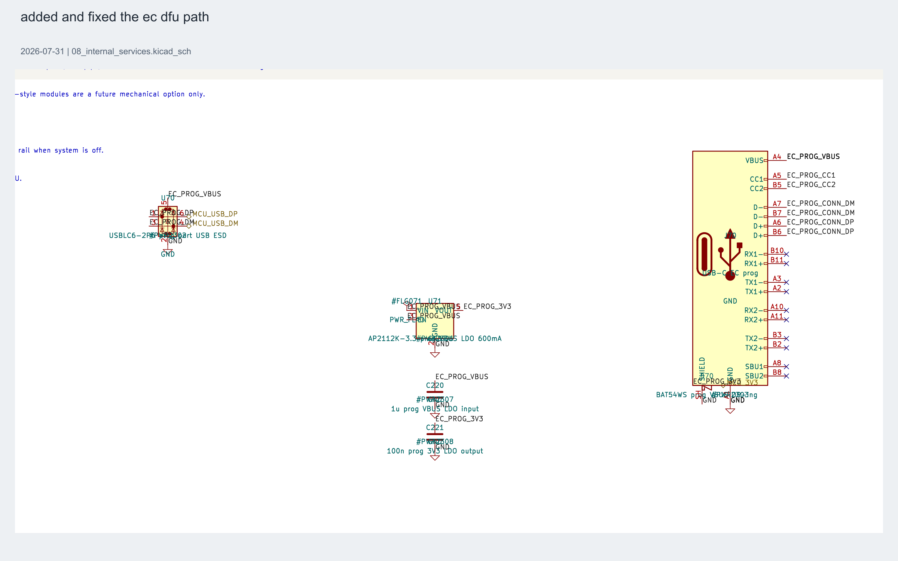

# 2026-07-31: wrote the behavior docs and headphone jack work

**Total time spent: 3 hours 48 minutes**

worked out how the laptop should behave in normal use, including the lid switch, charging inputs, keyboard, displays, cooling and audio. i wrote those decisions down so the firmware and hardware could follow the same behavior. the keyboard layout was already fixed because that board had been fabricated.

the main circuit change was adding the rear 3.5 mm headphone jack. i gave it plug detection so inserting headphones can mute the speakers, and added the headphone section to the system-audio sheet. that involved the jack connections and the control signals, not just putting another connector on the board.

i regenerated the affected schematic sheets and updated the audio and behavior documentation. i also added the keyboard image to the project so the chosen layout was visible alongside the rest of the design.

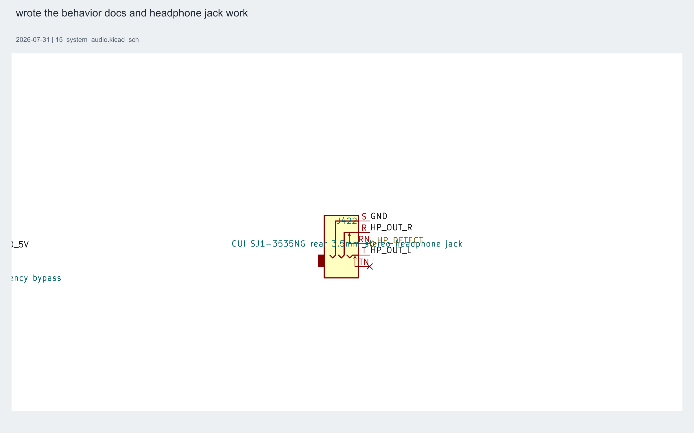

# 2026-08-01: host-tested the ec behavior

**Total time spent: 2 hours 45 minutes**

worked on the controller behavior and tested it on the computer before connecting it to hardware. i added the keyboard Fn-layer mapping, fan policy, OLED status content, lid-switch debounce and battery state handling.

the battery code needed to distinguish between a missing pack, an unknown reading, charging, discharging and a full battery. i added tests around those states so a missing or invalid measurement would not be treated as a valid battery reading. the lid and keyboard work also needed debounce handling, while the OLED code needed a consistent way to turn the controller state into text for the displays.

i also wrote up the eMMC recovery and hibernation setup. this session was mainly firmware and behavior work: making the individual pieces testable and deciding what the laptop should do when its inputs change.

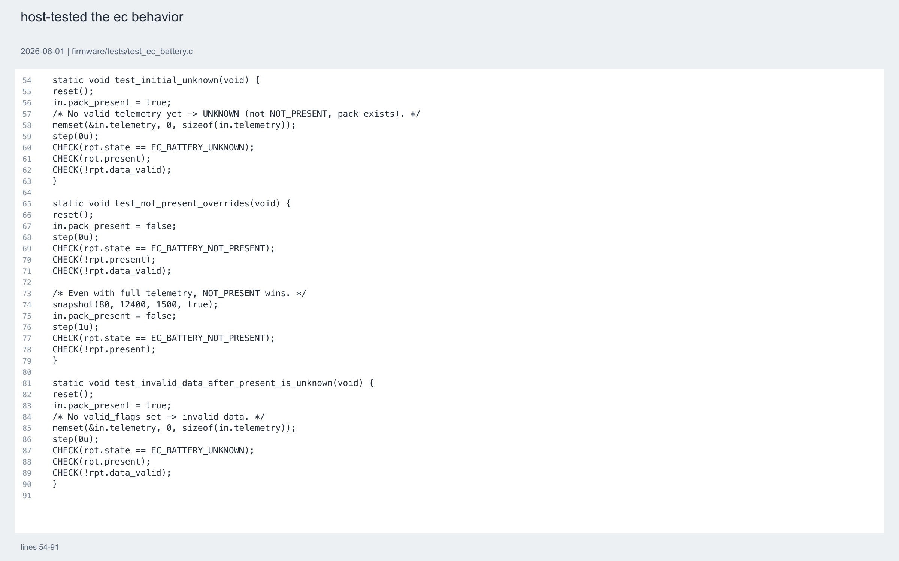

# 2026-08-01: worked through the bom, impedance, and placement prep

**Total time spent: 4 hours 42 minutes**

continued the BOM and routing preparation. i brought the part-number information into the generator's catalog and worked through the remaining procurement entries, so regenerating the schematics would keep the selected parts instead of losing that information.

i also calculated starting widths and gaps for the high-speed traces and added the corresponding net classes and board rules. those values needed to go with the intended layer stack, so i wrote down the impedance calculations and the pair-length budgets alongside the routing plan.

the other major part was placement cleanup. i added a tool to identify overlapping footprints and pads, then a second tool to make small, controlled moves of the crowded passive parts. i used the resulting reports to separate simple spacing problems from the larger components that needed a deliberate placement decision. that gave me a clearer list of what to move before spending time routing around it.

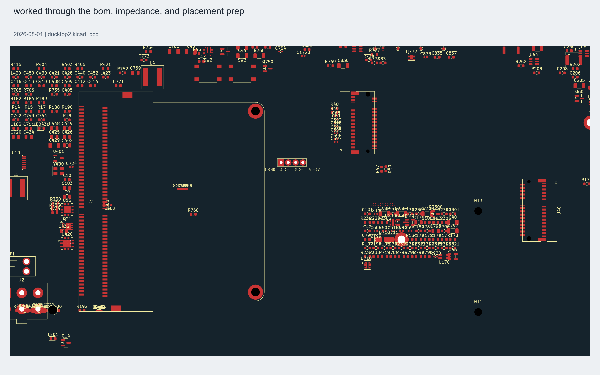

# 2026-08-01: built the ec driver and keyboard path

**Total time spent: 3 hours 34 minutes**

connected more of the controller's firmware to its actual devices. i added drivers for the BQ25798 charger and BQ34Z100 fuel gauge, including register reads, setting limits and reading the settings back. i used a mock I2C bus to exercise the transaction handling without needing a populated board.

i also built the keyboard path. that included scanning the matrix, debouncing the keys, applying the keymap and sending USB HID reports to the host. the scan code and USB descriptors needed to agree with the keyboard behavior i had already written, so i added tests around those pieces as well.

alongside that, i worked through the fan calculations and the code that connects device readings to the controller's decisions. i also checked the microphone placement and the trackpad overlap with the battery area. the firmware could now do more than calculate a policy; it had the driver and input code needed to communicate with the hardware.

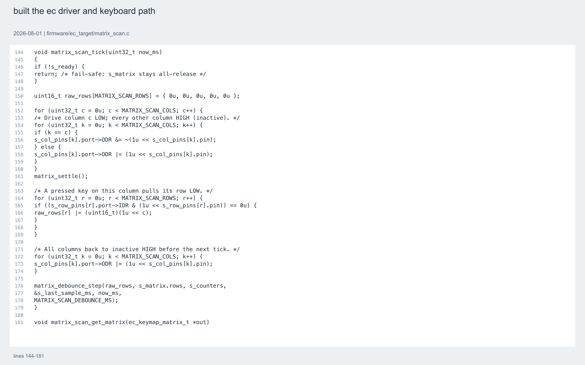

# 2026-08-01: added the headphone jack and cleaned up placement

**Total time spent: 1 hour 12 minutes**

brought the headphone-jack parts onto the PCB and continued sorting out placement collisions. eleven audio-section footprints needed to be added to match the new schematic.

i ran two more passes over the crowded passive parts, moving 190 parts in one pass and another 59 in the next. the reported pad shorts dropped from 199 to 54 across those passes. i kept a separate list of the larger components that needed manual placement decisions.

i also added the first ground planes, power islands and mechanical keepouts, and corrected the minimum through-hole drill setting to match the manufacturer's 0.2 mm capability.

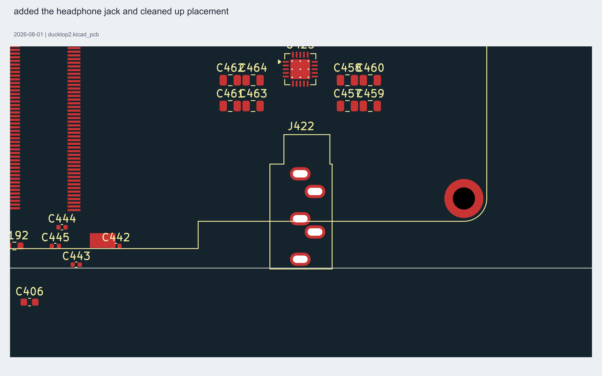

# 2026-08-01: tightened the floorplan and placement checks

**Total time spent: 1 hour 27 minutes**

went back to the floorplan and made it more useful for placement. i added the larger parts and OLED modules to the planner, checked their sizes, and updated the script that transfers the chosen positions onto the PCB.

i also fixed the placement tool's handling of the board boundary. some capacitors had been pushed outside the outline during earlier moves, so i brought those back and made the boundary part of the placement checks. i updated the hinge keepouts to the Framework hinge dimensions and applied the chosen floorplan with the main-board origin at zero. this tied the drawing and the actual board coordinates together more clearly.

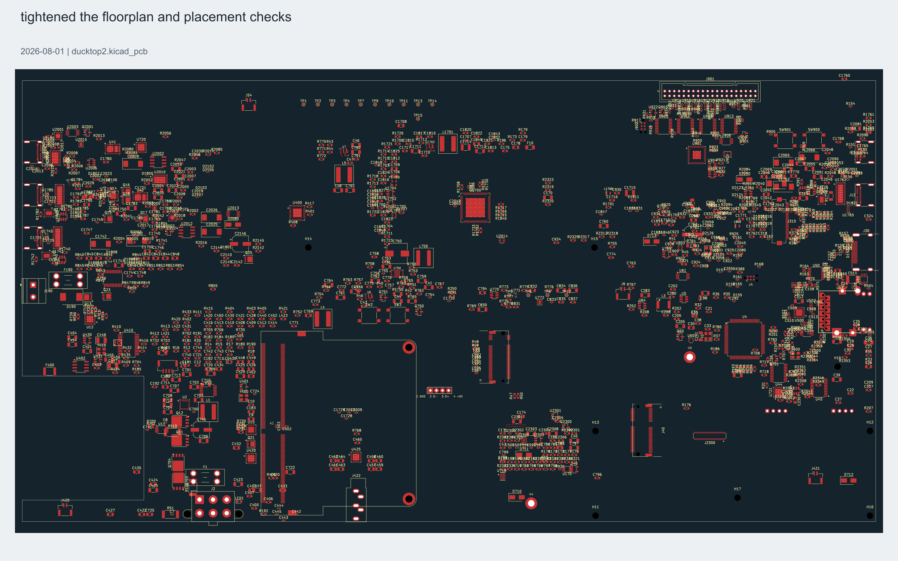

# 2026-08-01: applied the floorplan and changed the radio connector

**Total time spent: 2 hours 51 minutes**

applied the revised floorplan to the main board, including moving the Mu toward the upper-middle area. i then worked through the outline, zones and keepouts around the new positions. i added a board-boundary check to the placement script so another layout change could not silently leave parts outside the PCB.

i also changed the radio connection from the DF40 mezzanine connector to a 30-pin FH12 FFC connector. that required updating the connector footprint and its place in the layout. after applying the next floorplan revision, i ran another collision cleanup pass and reduced the reported shorts from 90 to 76. there was still placement work to do, but the floorplan and radio connection were now much closer to the arrangement i wanted.

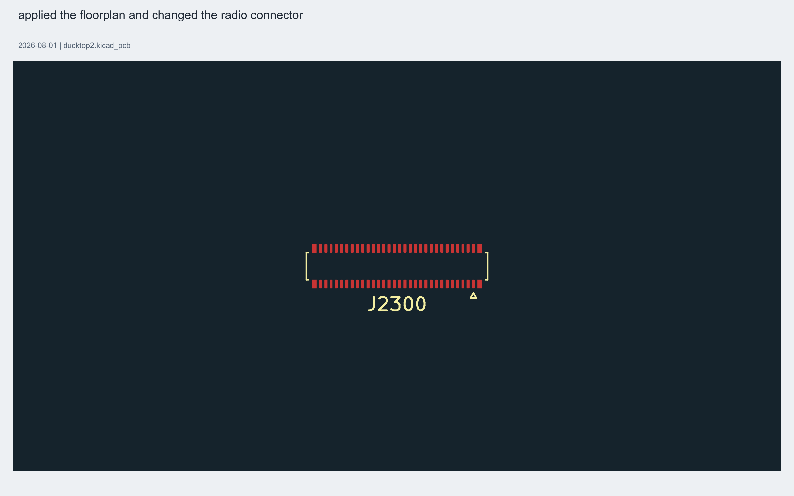

# 2026-08-02: cleaned up and restored the board geometry

**Total time spent: 1 hour 16 minutes**

cleaned up the board outline and drawing guides, including removing stale guide shapes, clipping the zones and restoring the radio connector's position.

the cleanup went through a couple of revisions. i changed the outline to a plain rectangle and cleared the old guides, then decided to restore the earlier board geometry instead. i brought back that version's edges, guides and zones so the board was left in a known layout. this entry includes that back-and-forth, rather than treating the first cleanup as the final result.

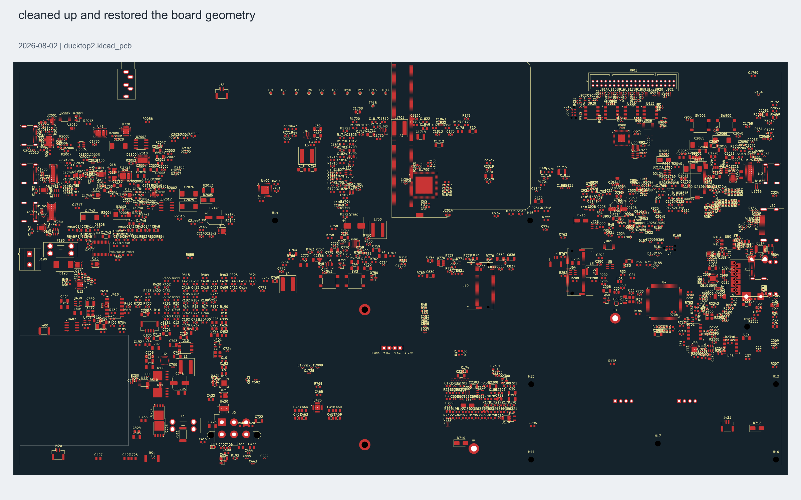

# 2026-08-09: repaired the board outline and guides

**Total time spent: 2 hours 44 minutes**

worked on the board outline and the placement guides again. the intended outline was a plain 358 by 185 mm rectangle, but old notch segments were still mixed into the edge drawing. i removed those pieces and replaced them with the correct straight edge.

i also fixed duplicated identifiers on the outline segments. that was separate from how the board looked on screen, but it mattered when loading and checking the file. after fixing the edges, i regenerated the drawing guides with unique identifiers and corrected the radio connector position. the saved file now had the intended outline instead of several different versions of it overlapping.

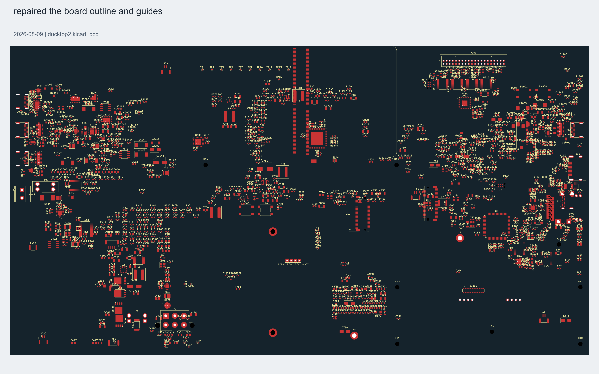

# 2026-08-09: removed the stale notch and restored the radio connector

**Total time spent: 1 hour 11 minutes**

removed the remaining old notch from the left side of the board. it was a leftover from an earlier layout and no longer belonged in the 358 by 185 mm outline.

i also restored the radio connector to its on-board position at 288.4, 149.1 mm. the outline and connector had both been affected by the earlier cleanup, so i fixed them together and saved that arrangement before continuing with the rest of the placement.

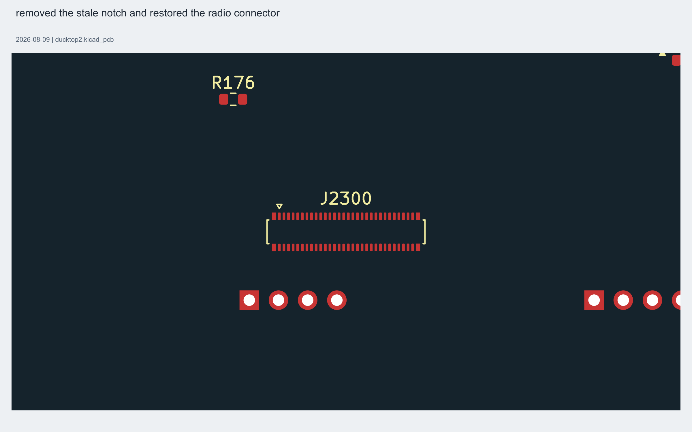

# 2026-08-11: fixed placement collisions and port layout

**Total time spent: 6 hours 13 minutes**

spent this session cleaning up the main-board placement and getting the external ports into the right places. the floorplan changes had left overlapping pads and several connectors whose positions did not match the intended case openings.

i applied the updated floorplan and worked through the pad collisions. i then adjusted the ports individually, including the two left-side connector heights and the M.2 card arrangement. changing a socket position also changes the space its card needs, so i checked those as assemblies instead of treating the connector body as the whole part.

i rebuilt the drawing guides from the actual footprint bounds so they would follow the board rather than show old positions. that was useful for comparing the connector locations against the floorplan and seeing where the larger parts were still crowding one another.

the work was mostly repeated placement adjustments and checking the result. i saved the corrected board, floorplan and guides together so the next placement changes could start from the same arrangement.

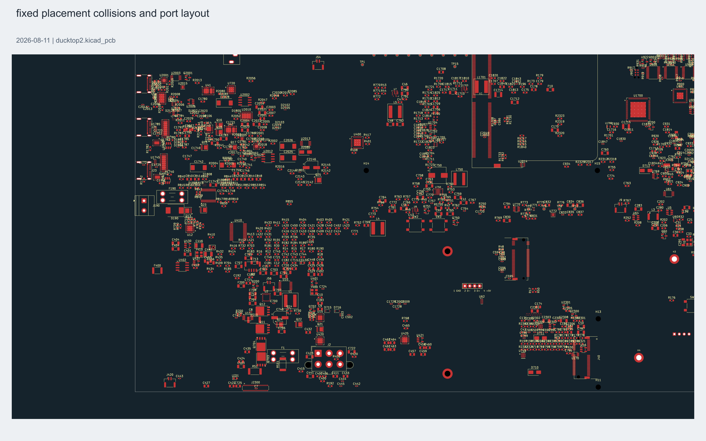

# 2026-08-12: fixed the outline, guides, and radio ffc

**Total time spent: 2 hours 22 minutes**

added the recess for the mid-mount ethernet jack and checked how the surrounding ports and M.2 slots lined up with the board. that connector needs room in the edge itself, so a rectangular outline was no longer enough in that area.

i also worked through the remaining reported shorts, bringing that group from 49 down to zero, and cleaned up the old drawing guides. i removed 67 stale guide blocks and rebuilt 21 aligned pairs from the current placement.

finally, i replaced the radio connector with the FH12-30S FFC footprint and removed 52 dangling route stubs left around the old connection. the outline, guides and connector changes are all saved in this version.

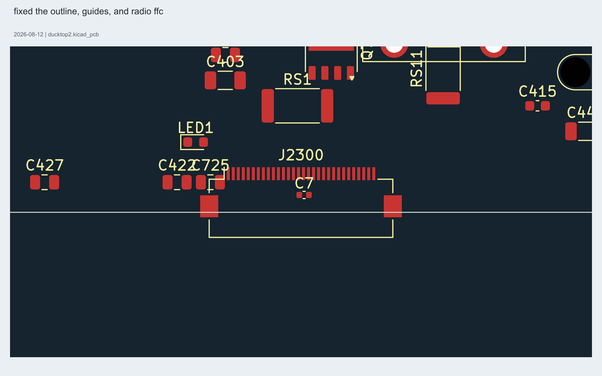

# 2026-08-12: worked through the f1-f9 placement review

**Total time spent: 2 hours 20 minutes**

worked through the placement problems found in the board review. the biggest one was the Mu socket: part of its footprint and the matching standoff positions did not fit the board properly. i moved the module south and moved its two supports with it, so the mounting arrangement followed the module instead of staying behind at its old position.

i cleared nearby control parts from the Wi-Fi socket and moved the keyboard FFC series resistors away from its pad field. i also brought the radio connector fully onto the board, corrected its part information, and moved the ethernet crystal next to its controller.

the rest of the session covered the mounting pattern, external clearances and the real impedance net classes. i updated the mechanical notes to match the resulting board, including the ethernet recess, and wrote down the final changes so i could continue from the corrected positions.

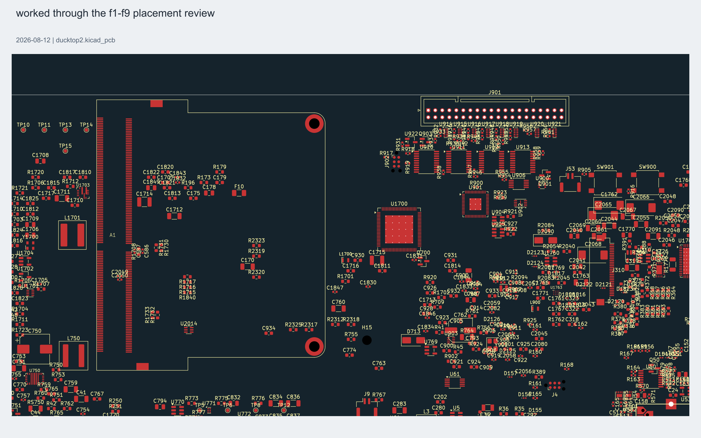

# 2026-08-13: cleaned placement and started the independent review

**Total time spent: 4 hours 12 minutes**

continued cleaning up the placement, then took a closer look at the electrical connections behind it. i worked through the placement-related DRC findings and got the board down to 186 reported violations at that point.

the radio connector turned out to need more than a spacing fix. checking its pad numbers against the schematic showed mismatches across 26 pads, so i recorded the affected connections before changing it again. i also revisited some earlier reported problems and separated the actual connector issue from the ones that did not apply.

this changed what i needed to do next. a connector can look correctly placed while still assigning the wrong signal to a contact, so i checked the pin mapping as well as the physical fit. i kept the layout cleanup and the remaining connector work written down together.

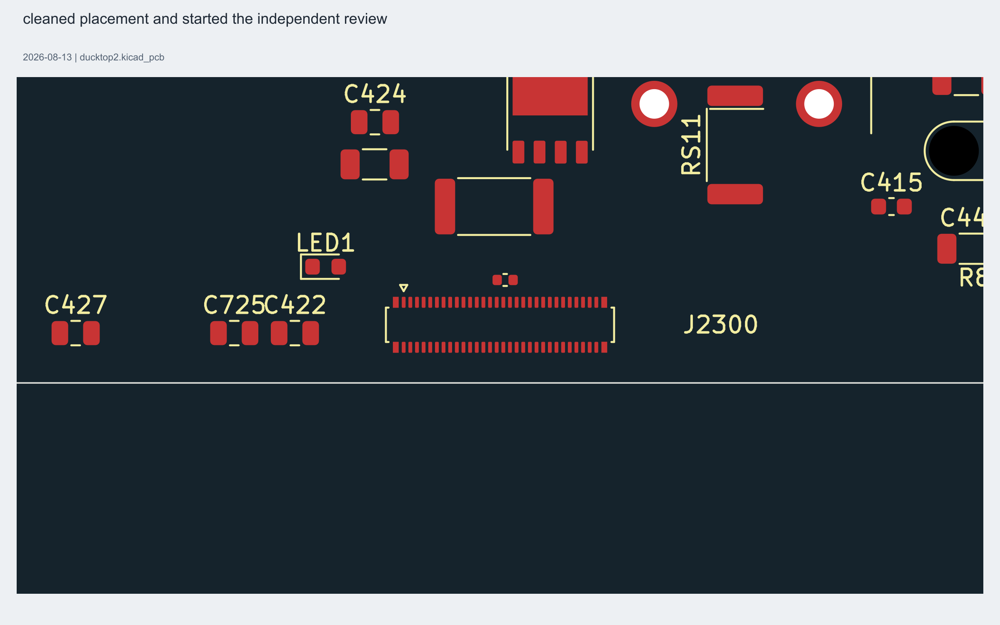

# 2026-08-13: fixed j2300 and closed the electronics review

**Total time spent: 4 hours 25 minutes**

fixed the radio connector's pin mapping and worked through more of the board issues. i replaced J2300 with the FH12-30S connection and synchronized all 30 contacts with the schematic, then checked the resulting board assignments.

i also completed the controller's USB programming connection and changed the radio-board power arrangement. other corrections covered the fan tachometer signal, the Mu sleep signal and the serial interface. these were separate connections that needed checking across the schematic, controller assignments and board.

on the mechanical side, i corrected the Mu mounting arrangement and the keyboard FFC placement. the module socket and its standoffs now moved together, and the keyboard connector had the clearance it needed. i updated the board, part lists and notes to match these changes, including the corrected radio and programming connectors.

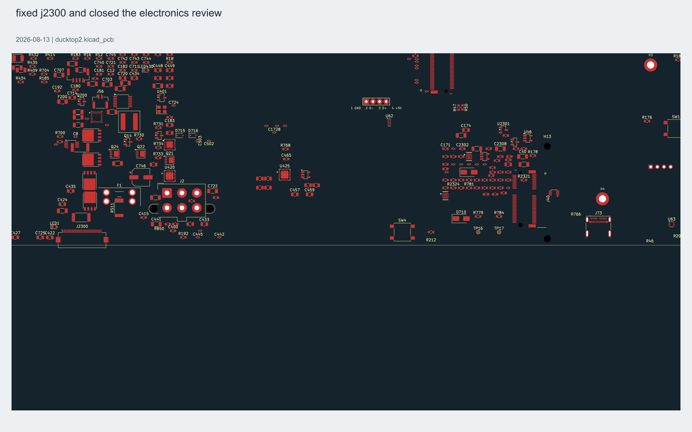

# 2026-08-13: finished the mechanical review and moved to eight layers

**Total time spent: 3 hours 5 minutes**

worked through the case layout and the vertical space inside the laptop. my first arrangement put the batteries and trackpad in separate front-to-back bands, which made the base much deeper than it needed to be. i changed the plan so the trackpad sits above the battery row, with support and separation between them. that brought the planned footprint back to 358 by 248 mm.

i also moved the main board from six layers to eight. i kept the impedance requirements with the new stackup and planned where the signal, ground and power layers would go.

for the power layer, i started mapping the individual supply islands rather than treating it as one large plane. the mechanical drawing and the layer plan were both updated for this version of the laptop.

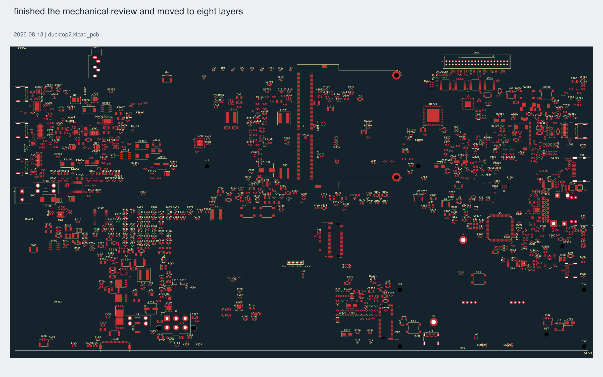

# 2026-08-14: did the pre-routing audits

**Total time spent: 2 hours**

checked several things before committing more time to routing. i looked at how the Mu socket's pads could escape onto the signal layers, checked the available power against the loads, and went through the footprints for the parts that were easy to get wrong.

i wrote the results into the routing and power notes, including the constraints around the Mu fanout. this was mostly checking the design and deciding how to approach those areas, rather than adding more tracks to the board.

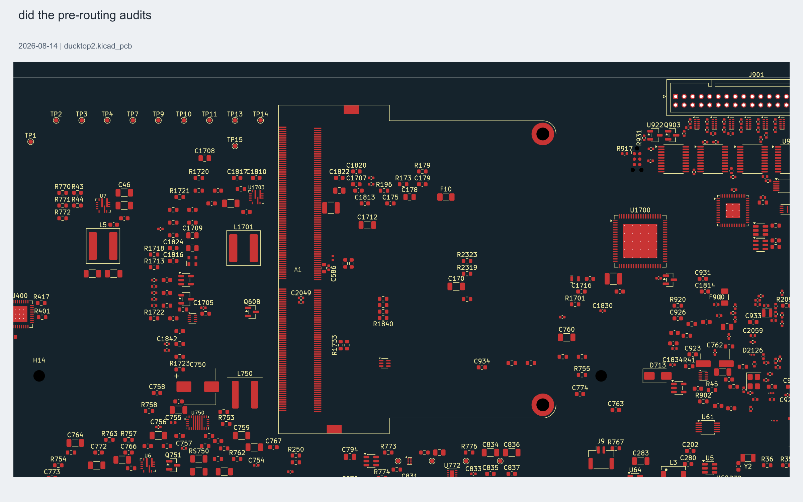

# 2026-08-23: prepared the nvme, rtc, and nextpcb submission

**Total time spent: 3 hours 25 minutes**

worked on the nvme supply, the real-time clock power and the information for NextPCB. i added more power headroom for the SSD and changed the RTC supply to use the battery pack, removing the separate coin cell from the design.

i then put together the eight-layer manufacturing details: the proposed stackup, copper, board thickness, via sizes and the impedance requirements. i compared the board's design rules with the manufacturer's capabilities so differences were written down before sending the files for review.

i also set the solder mask to black, with matte preferred, and checked the planned mask spacing against the stated manufacturing limit. the resulting files describe the actual board and the fabrication choices i wanted NextPCB to check.

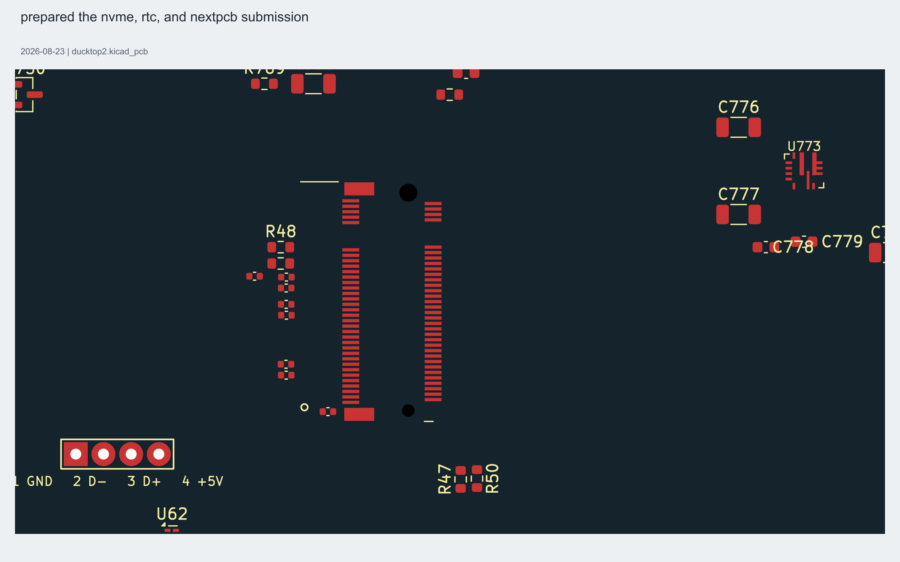

# 2026-08-24: closed phase 1 and approved the stackup

**Total time spent: 3 hours 30 minutes**

finished another pass over the board rules and manufacturing setup. i went through the fabrication limits, the thermal and routing plans, and the silkscreen, then checked the saved design against the information in those documents.

that pass turned up twelve outdated checks and four board problems that needed correcting. i fixed those before applying the manufacturer's impedance values. the trace widths and pair gaps needed to come from the approved stackup rather than remain at the earlier estimates.

i saved NextPCB's supplied geometry in the project settings and updated the stackup record. this brought the board rules, routing notes and manufacturing information together around the same layer construction.

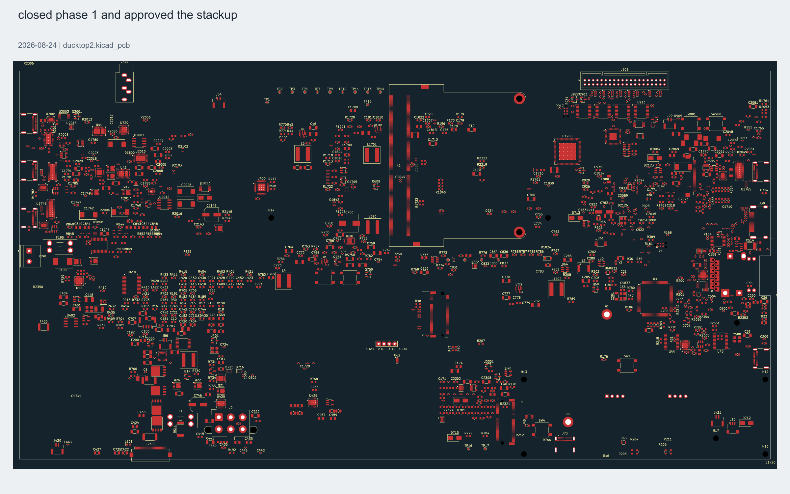

# 2026-08-24: fixed the radio, usb-a, and placement updates

**Total time spent: 2 hours 40 minutes**

updated the radio-board footprint in the floorplan and worked on the spare USB-A ports. the radio section now used the intended 160 by 110 mm outline with four M2 mounting points in the mechanical drawing.

i added the USB-A connections on the hub's spare ports, then placed the new parts and matched the board to the schematic. i also saved the connector and capacitor positions i had adjusted in KiCad, including the programming port, AUX input and right-side USB connector.

after those changes, i regenerated the schematic sheets together so the files reflected the current USB-A and placement work. this session was mainly getting the added ports and the physical layout to agree.

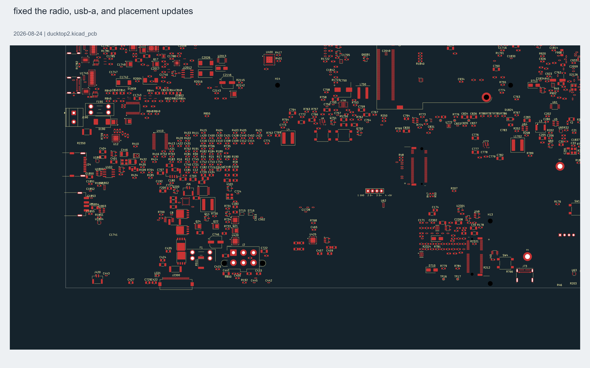

# 2026-08-24: finished the usb-a routing prep and power zones

**Total time spent: 4 hours 33 minutes**

worked on the USB-A section and the power copper around the updated placement. i cleaned up the port cluster and wrote out how its signal pairs and supporting connections should reach the hub. the USB3 port uses the hub's SuperSpeed connection, while the other added port uses USB2.

i connected the USB3-A port's high-speed nets and grounded its shield, then updated the net classes for those signals. i also fixed the mounting pattern into eight intended points, keeping the holes clear of the larger components and their mechanical space.

a large part of the session went into rebuilding the power zones and mounting-hole keepouts at the current positions. i updated the full-board routing plan and the high- and medium-current trace classes alongside that work. those settings needed to follow the actual board layout, rather than the earlier positions the first zones had been based on.

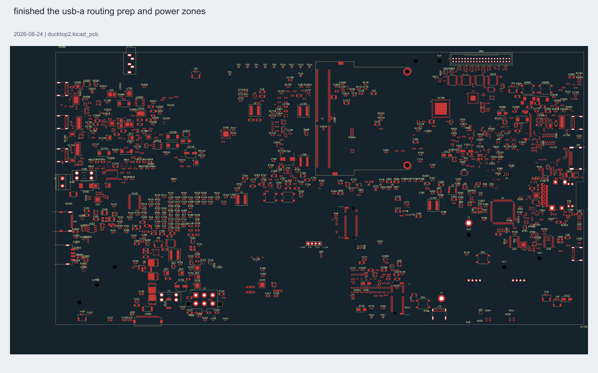

# 2026-08-25: set the routing presets and board layout

**Total time spent: 2 hours 58 minutes**

put the routing widths and gaps into the project settings so the right values were available while drawing tracks. i also assigned colors by routing function across the board's nets, which made it easier to follow the different groups in KiCad.

i restored the right-side USB connector to the intended position opposite the left one and updated the power-zone layers to match the stackup plan. i refreshed the drawing guides from the saved board, then added the Framework hinge cutouts to the actual outline and removed the old guide shapes. the routing setup and the board edges now reflected the same layout.

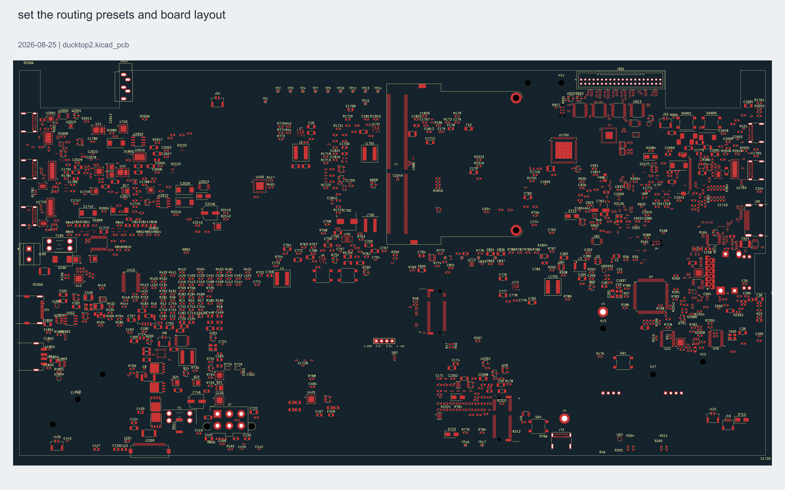

# 2026-08-25: fixed colors, hinge cutouts, and release checks

**Total time spent: 3 hours**

fixed the net colors after finding that i had saved them in the wrong format and location for KiCad. i changed them to the format the editor actually reads, reapplied the colors, and made the standby fault signal easy to pick out in red.

i also aligned the moved mounting holes with the edge rails and made the two hinge cutouts symmetric. those edits needed to be made on the board outline itself, not just shown in a drawing layer.

while checking the result, i fixed a broken variable reference in the board-checking script. that restored the check which had stopped working after an earlier edit, so i could use it on the updated layout again.

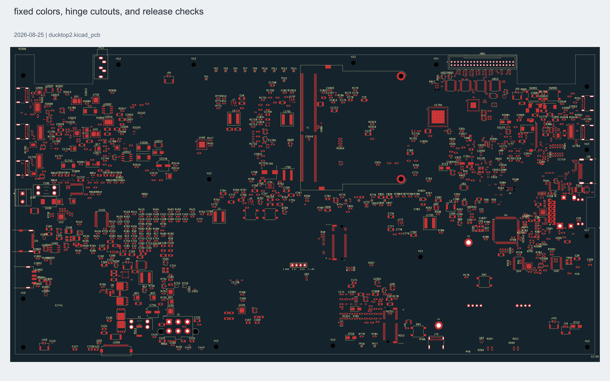

# 2026-08-26: fixed mounting holes, power islands, and board formats

**Total time spent: 5 hours 13 minutes**

worked through the mounting holes, power islands and a few file problems that were getting in the way of routing. some mounting-hole references were duplicated, so i renumbered them and added their matching schematic symbols. that kept the mechanical parts identifiable when comparing the schematic and PCB.

the power layer also had islands with the wrong net names. i corrected those to use the names from the schematic hierarchy, separated the two raw USB input rails and applied the intended 85-ohm pair geometry. this was more than a visual cleanup, because an island assigned to the wrong net cannot supply the parts it was drawn for.

i fixed an outdated check around two hub ports that were now active USB-A connections, rather than treating them as unused straps. i also renamed the letter-suffixed transistor reference that was breaking annotation and normalized a library file's line endings.

these were a mixture of electrical and project-file problems. i saved the board and its supporting definitions together so the corrected power nets and references would survive the next regeneration.

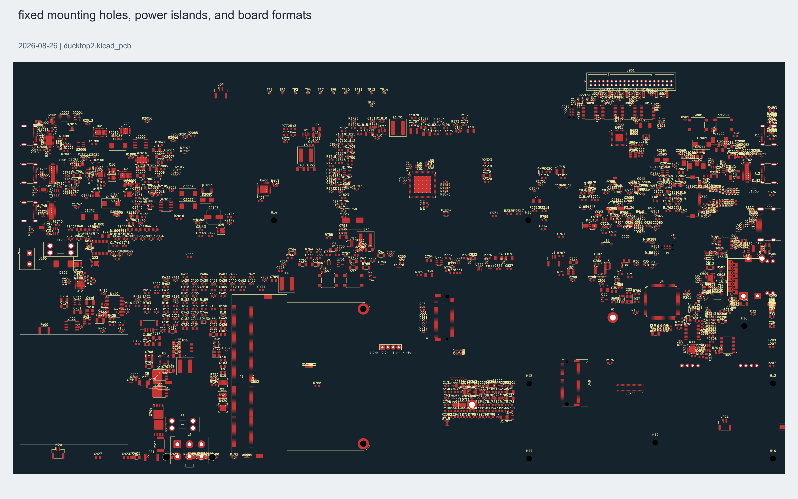

# 2026-08-26: updated the pitch and ec startup work

**Total time spent: 2 hours 47 minutes**

put together the project funding description and the cost breakdown. the parts estimate came to roughly $3,560, so i added that information to the readme and explained what the money would cover, including the computer module, boards and the other laptop parts.

i also worked on the embedded controller's startup code. i fixed the memory initialization, clock setup, timer rates and ADC register mapping, then corrected the source-manager behavior so a communication problem would not leave it assuming that a power input was valid.

this combined the project writeup with several small but important firmware fixes. the startup code has to establish the right state before the rest of the controller starts making power decisions.

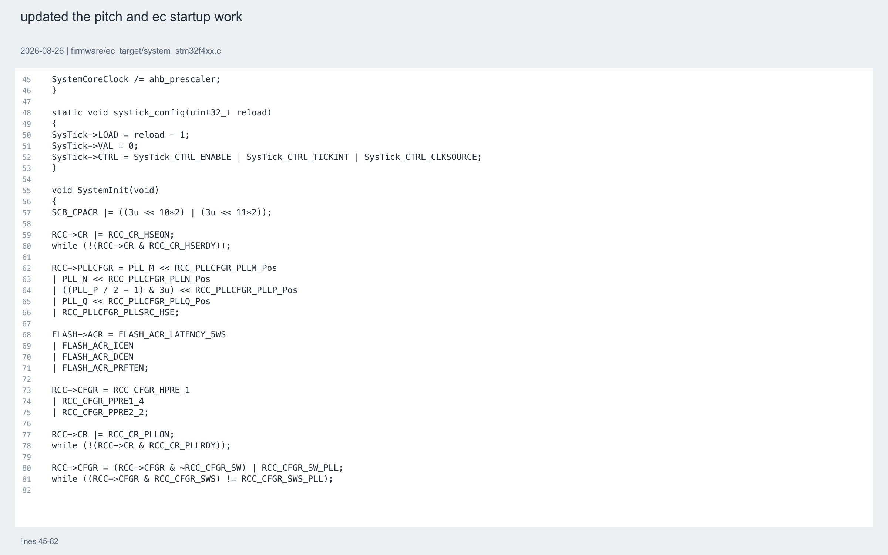

# 2026-08-26: fixed the ec mappings and hardened the release checks

**Total time spent: 1 hour 12 minutes**

corrected the main-board net classes and divided up the power layer according to the intended supply rails. i also fixed the controller's USB register and request handling, and checked the power-limit calculations against the actual target settings.

i tightened the board checks so they examine a refilled copy of the PCB and compare its findings with the specific exceptions i had recorded. i also made the saved board-object identifiers unique and repeatable, so duplicate objects and unexplained file changes would be easier to catch. the work was spread between the PCB settings, firmware and the scripts used to check the saved design.

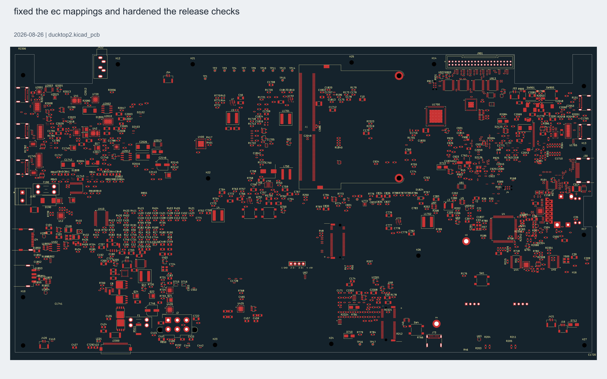

# 2026-08-26: finished the quote package, impedance approvals, and eight-layer docs

**Total time spent: 22 minutes**

regenerated the NextPCB quote files from the current board and part list. i updated the information for the endpoint regulator and USB-A cluster, then saved the BOM and placement data together with the package details.

i also recorded the supplied impedance values in the stackup file and updated the documentation that still described the older layer arrangement. the quote files and the eight-layer notes now referred to the same board revision.

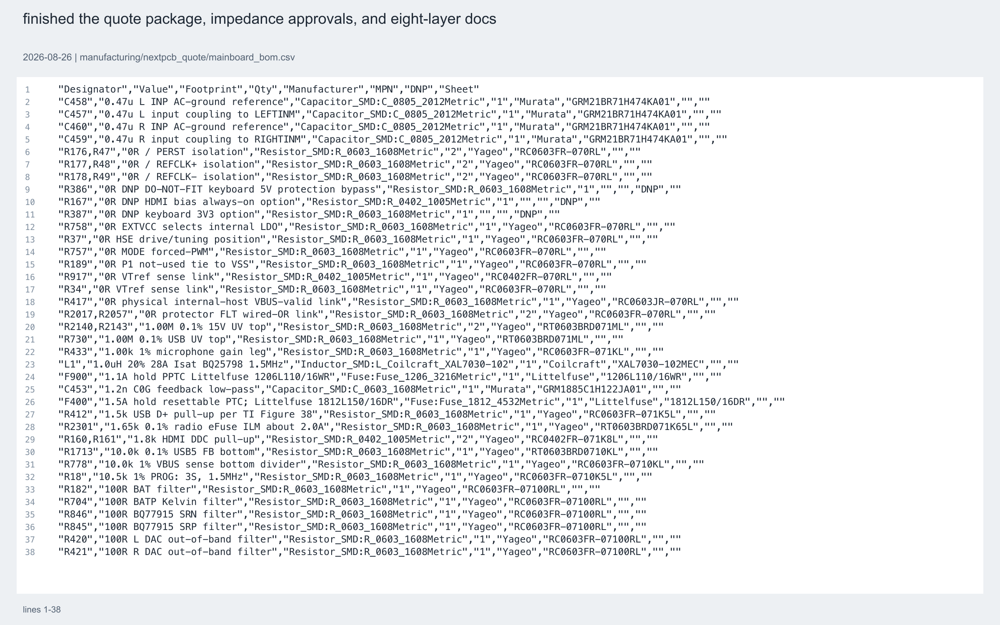

# 2026-08-27: documented the source-local l5 island architecture

**Total time spent: 45 minutes**

wrote up how the power islands should be arranged on the inner power layer. the idea is to keep each supply island around its source circuit, rather than spreading every rail across the whole board and letting the zones become tangled.

i documented that arrangement for the routing work, including how the separate rails should stay distinct. this was a planning and documentation session for the power layer; the pictures show the board i was using while working it out.

