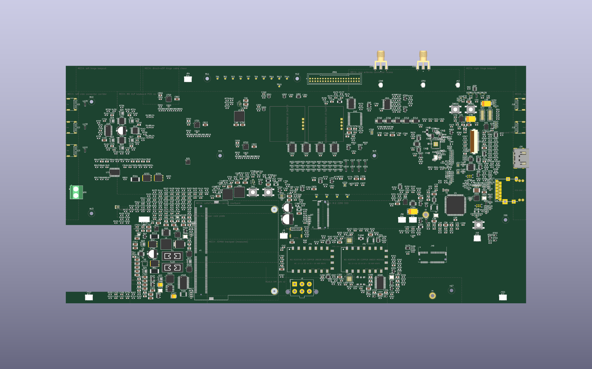
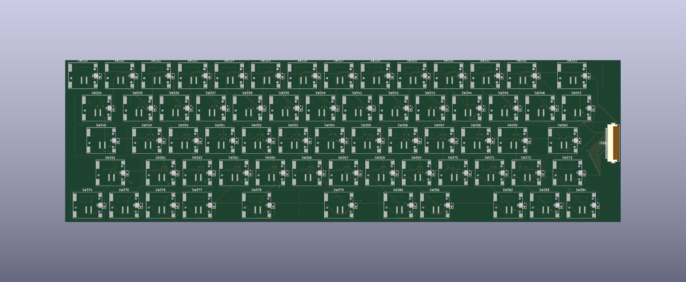
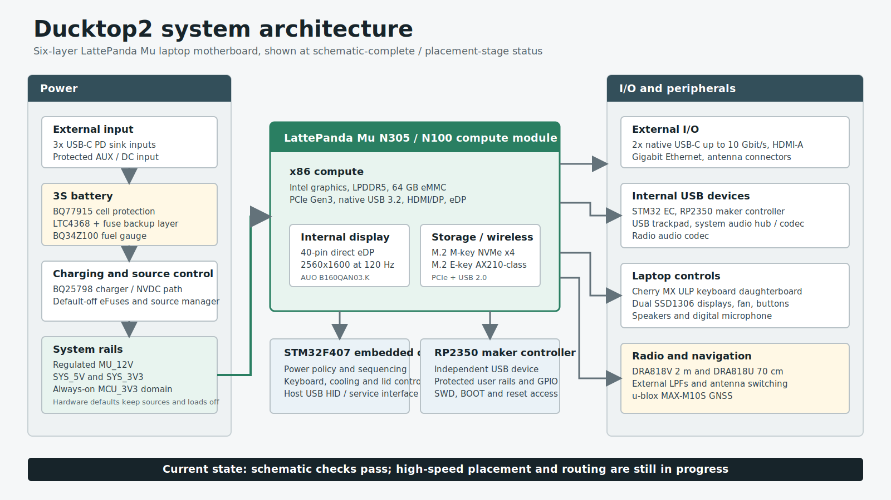

# Ducktop2

Ducktop2 is my second DIY laptop: a 16-inch x86 machine built around the
LattePanda Mu. The goal is to keep the flexibility and exposed hardware of a
cyberdeck while making the finished computer feel like a normal thin laptop.

My first version used a Raspberry Pi 500+ and a portable monitor. It worked,
but the HDMI and USB-C cables had to loop around the outside of the case.
Ducktop2 replaces that stack with one purpose-built motherboard and a separate
low-profile mechanical keyboard.



> **Current state, July 2026:** the generated motherboard schematic passes ERC
> and the project checks. The six-layer PCB has its outline and 997 synchronized
> footprints, but high-speed placement is still being revised and routing has
> not started. The images in this repository are placement-stage renders.

## Hardware

- LattePanda Mu with an Intel N305 or N100-class module
- 16-inch AUO B160QAN03.K panel, 2560x1600 at 120 Hz over direct eDP
- M.2 M-key NVMe storage and M.2 E-key Wi-Fi/Bluetooth
- Two native USB-C 10 Gbit/s host ports, external HDMI-A, and Gigabit Ethernet
- Three USB-C PD charging inputs plus a protected AUX/DC input
- Three-cell battery with BQ77915 cell protection, BQ25798 charging, a fuel
  gauge, a fuse, and a separate whole-pack protection layer
- STM32F407 embedded controller for power, keyboard, cooling, displays, and
  laptop controls
- Chip-down RP2350 maker controller with protected user power and GPIO
- Separate 65-key Cherry MX Ultra Low Profile keyboard PCB
- USB trackpad, stereo speakers, digital microphone, and two SSD1306 displays
- Dual-band VHF/UHF radio modules, external filters, antenna switching, and GNSS





## Design Notes

The motherboard is a generated hierarchical KiCad 10 project. The Python files
in `gen/` are the source for the active schematic sheets and the project-local
symbol/footprint libraries. The main hierarchy currently has 14 child sheets.

The LattePanda Mu's onboard 40-pin eDP connector drives the internal panel.
The former Intehill controller-board path has been removed from the motherboard;
the working Intehill board is kept only as a bench fixture for the panel.

The three 100 x 60 mm cells sit in the front battery band, outside the current
358 x 185 mm motherboard outline. The full base envelope is provisionally
358 x 248 mm to match the measured 352 x 227 mm panel without a rear bump.

More detail:

- [Hardware architecture](docs/hardware.md)
- [Current design status](docs/design-status.md)
- [Direct-eDP panel and cable work](docs/display-direct-edp.md)
- [Mechanical measurements](docs/mechanical.md)
- [Firmware policy](firmware/README.md)
- [Keyboard production package](manufacturing/keyboard_revA_jlcpcb/README_JLCPCB.md)
- [Verification summary](verification/README.md)
- [Selected schematic export](docs/exports/ducktop2-selected-schematics.pdf)
- [Independent review prompt](docs/review-prompt.md)
- [Ducktop1 background](docs/ducktop1.md)

## Repository Layout

| Path | Contents |
| --- | --- |
| `ducktop2.kicad_*` | Main KiCad project and six-layer motherboard |
| `01_*.kicad_sch` ... `16_*.kicad_sch` | Generated hierarchical sheets |
| `gen/` | Schematic generators, local symbols, and verification tools |
| `ducktop2.pretty/` | Project-local footprints |
| `firmware/` | Host-tested EC and maker-controller policy cores |
| `mechanical/` | Current dimensions, floorplans, and retention contracts |
| `manufacturing/` | Keyboard rev-A production package and release gates |
| `software/os-theme/` | Early Fedora KDE theme work |
| `verification/` | Current checks and concise release evidence |
| `docs/` | Architecture, status, renders, schematic exports, and project background |

## Open and Check the Project

KiCad 10.0.4 is the current reference version. Clone the repository and open
`ducktop2.kicad_pro`:

```sh
git clone https://github.com/EwoudVV/ducktop2.git
cd ducktop2
```

The main staged schematic check runs in an isolated copy and leaves the live
PCB alone:

```sh
python3 gen/check_release_candidate.py --stage schematic
```

The host-side firmware policy tests do not require a vendor SDK:

```sh
firmware/tools/run_host_tests.sh
```

See [build and verification](docs/build-and-verify.md) before regenerating the
schematics or comparing the PCB to the netlist.

## Project Scope

This repository is public so the design can be reviewed while it develops.
It is not an ordering package for the mainboard. Part selection, placement,
routing, stackup, enclosure work, firmware integration, and first-article
testing are still active work.

The project does not currently have an open-source license. Please ask before
reusing the design or manufacturing from it.
