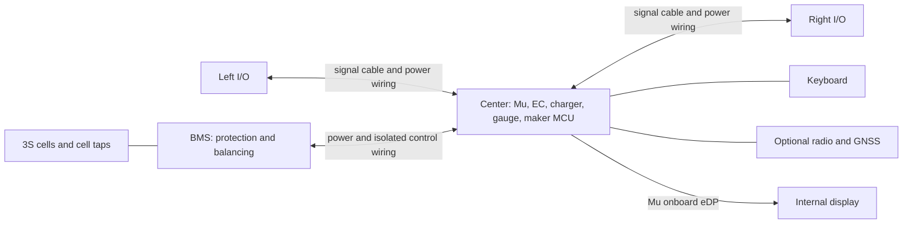

# Ducktop2

i'm building a 16-inch x86 laptop around the LattePanda Mu Ultra. i wanted the
exposed hardware and flexibility of a cyberdeck in something i could
actually carry around and use every day.

ducktop1 used a Pi 500+ and a portable monitor, with HDMI and USB-C cables
looping around the outside of the case. ducktop2 brings the display onto
direct eDP and puts power, ports, and laptop controls on custom boards.

## what's in it

- LattePanda Mu Ultra 226V initially, with the carrier designed to support a later 256V upgrade; 16 GB RAM and NVMe storage
- 16-inch AUO B160QAN03.K, targeting 2560x1600 at 120 Hz over direct eDP
- M.2 NVMe and a separate Wi-Fi/Bluetooth socket
- 65-key Cherry MX Ultra Low Profile keyboard and a 140 x 105 mm USB trackpad
- five USB-C ports, two USB-A ports, HDMI, and Gigabit Ethernet
- a 3S battery, USB-C PD charging from either side, and AUX/DC input
- STM32F407 for laptop control and a separate RP2350 with protected maker GPIO
- two status OLEDs, speakers, a headphone jack, and a microphone
- optional VHF/UHF radio, GNSS, and a separate radio audio path

## build status

updated 23 september 2026. the compute target is now Mu Ultra: start with
the 226V and design the power, cooling and carrier for the 256V too. the
saved main-board circuits still need the N305-to-Ultra changes. the
[module requirements](manufacturing/lattepanda_mu_bios_release.md) separate
that target from the current CAD and the remaining hardware checks.

the audit repairs are still in progress. both
I/O boards now have the revised power circuits, separate power wiring, and
new signal connectors in their saved schematics and layouts. the right
board also has the HDMI pair corrections and repairs to the USB routing i
started. compatible existing routing is preserved. the center
revision is also integrated, with its power-support placement corrected and
its edges moved inward for board gaps. the main-board routing and final
project checks still need work.

the keyboard now has per-key RGB on four layers, with its schematic and
placement ready for routing. the previous tracks and pours are cleared. the key positions,
outline and cable connector are unchanged. [keyboard routing notes](keyboard/README.md)
cover the LEDs, current limit and switch keepouts. the old non-RGB order
files have been retired. the radio antenna connectors now match the board edge and their
mechanical drawing. the radio still needs routing.

the four-layer BMS is now routed, including the separate power and control
cables and all three temperature probes. it has zero unconnected items,
zero physical DRC errors and no schematic mismatch. the power paths and
separate return connections were checked too. [BMS layout checks](verification/bms-layout.md)
has the results and the remaining hardware tests. the [PCBWay package](manufacturing/bms/pcbway/README.md)
is ready for a prototype quote and factory review. the three main-board
sections are eight layers, and most of their routing still remains.

firmware corrections cover charger communication, startup, watchdog and fan
handling, USB power permissions, and host communication. assembled-hardware
tests are still pending. the replacement panel has run at 2560x1600 and
120 Hz on the Intehill controller; the final Mu-to-panel cable still needs
validation. the complete laptop is not ready for fabrication or powered
integration.

## boards

```mermaid
flowchart LR
    L[Left I/O] <-->|signal cable and power wiring| C[Center: Mu, EC, charger, gauge, maker MCU]
    C <-->|signal cable and power wiring| R[Right I/O]
    B[BMS: protection and balancing] <-->|power and isolated control wiring| C
    Cells[3S cells and cell taps] --- B
    C --- K[Keyboard]
    C --- Radio[Optional radio and GNSS]
    C -->|Mu onboard eDP| Panel[Internal display]
```

the center charges the whole pack. the BMS monitors the cell taps and
balances cells locally. the EC and maker controller have separate jobs,
and the rest of the laptop is intended to work with the radio board removed.

## open in KiCad

the current reference version is KiCad 10.0.4.

| Work | File |
| --- | --- |
| Center schematic | `ducktop2.kicad_pro` |
| Center layout | `ducktop2-center.kicad_pcb` |
| Left I/O | `left_io/left_io.kicad_pro` |
| Right I/O | `right_io/right_io.kicad_pro` |
| BMS | `bms/bms.kicad_pro` |
| Keyboard | `keyboard/12_keyboard_daughterboard.kicad_pro` |
| Radio | `radio_daughterboard/radio_daughterboard.kicad_pro` |

read [build and verification](docs/build-and-verify.md) before regenerating
or syncing a board. the center schematic and PCB have different basenames.
review an explicit current netlist before updating the PCB; rebuilding a
board can replace existing routing.

## files and documentation

| Location | Contents |
| --- | --- |
| Root KiCad files | Center project and active schematic hierarchy |
| `left_io/`, `right_io/`, `bms/`, `keyboard/`, `radio_daughterboard/` | Separate board projects |
| `gen/` | Schematic generators, validation code, and symbol definitions |
| `ducktop2.pretty/`, `Module_LattePanda.pretty/`, `ducktop2.3dshapes/` | Shared footprints and models |
| `docs/hardware/` | Circuit, cable, display, and mechanical documentation |
| `firmware/` | EC/maker code, tests, and firmware release records |
| `mechanical/` | Current floorplan and layout planner |
| `reference/` | Source/reference designs and retained generator inputs |
| `manufacturing/` | Board packages, quotes, and manufacturing requirements |
| `verification/` | Hardware validation record and ignored generated checks |
| `software/` | Fedora setup, recovery, and theme files |

- [hardware and behavior](docs/hardware/overview.md)
- [power and battery](docs/hardware/power-and-battery.md)
- [cables and connectors](docs/hardware/cables-and-connectors.md)
- [display harness](docs/hardware/display-direct-edp.md)
- [mechanical layout](docs/hardware/mechanical.md)
- [build and verify](docs/build-and-verify.md)
- [bring-up procedure](docs/BRINGUP_TEST_PLAN.md)
- [parts and cost](docs/bom-and-cost.md)
- [firmware](firmware/README.md)
- [manufacturing](manufacturing/README.md)
- [OS work](software/os-theme/README.md)
- [ducktop1](docs/ducktop1.md)
- [Forge project pitch](docs/forgery_pitch.md)
- [project journal](JOURNAL.md)

## sponsors

thanks to NextPCB for supporting PCB manufacturing and assembly for ducktop2!

## license

the project files are under the [MIT license](LICENSE).
