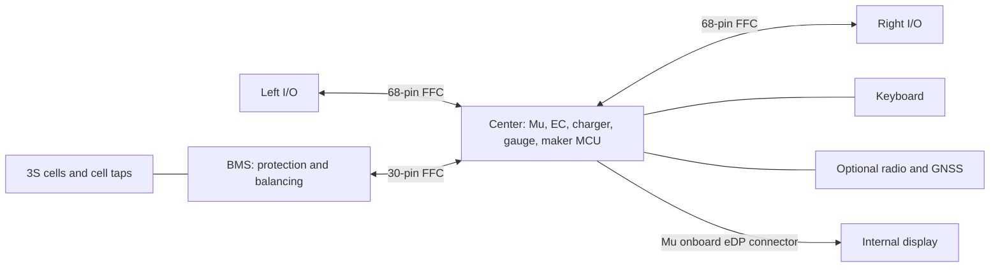

# Ducktop2

i'm building a 16-inch x86 laptop around the LattePanda Mu. i wanted the
exposed hardware and flexibility of a cyberdeck in something i could actually
carry around and use every day.

ducktop1 used a Pi 500+ and a portable monitor. it worked, but the HDMI and
USB-C cables had to loop around the outside of the case. ducktop2 gets the
display onto direct eDP and puts the power, ports, and laptop controls on
custom boards.

**last checked: 4 september 2026.** the BMS is routed and under review. the
center and two I/O boards are placed and still need routing. the keyboard
has a rev A production package. the laptop is not ready to order or power up
as a complete assembly yet. [current status](docs/design-status.md)

## what's in it

- LattePanda Mu with an Intel N305, a 16 GB RAM target, and 64 GB onboard eMMC
- 16-inch AUO B160QAN03.K display, targeting 2560x1600 at 120 Hz over direct eDP
- M.2 NVMe storage and a separate M.2 Wi-Fi/Bluetooth socket
- 65-key Cherry MX Ultra Low Profile keyboard and a 140 x 105 mm USB trackpad
- five USB-C ports, two USB-A ports, HDMI, and Gigabit Ethernet
- a 3S battery, USB-C PD charging from either side, and an AUX/DC input
- STM32F407 embedded controller for the laptop's power, keyboard, fan, and controls
- a separate RP2350 maker controller with protected GPIO and user power
- two status OLEDs, speakers, a headphone jack, and a microphone
- an optional radio board with VHF/UHF, GNSS, and its own USB audio path

the EC and maker controller have separate jobs. experimenting with the GPIO
should leave the laptop's charging, cooling, and keyboard alone. the radio
board is optional too, so the rest of the laptop can work while it's removed.

## how the boards fit together

the carrier started as one large board. it is now split into a center board,
left and right I/O boards, and a small BMS. three FFC cables connect them.
the keyboard and radio are separate boards as well.

```mermaid
flowchart LR
    L[Left I/O] <-->|68-pin FFC| C[Center: Mu, EC, charger, gauge, maker MCU]
    C <-->|68-pin FFC| R[Right I/O]
    B[BMS: protection and balancing] <-->|30-pin FFC| C
    Cells[3S cells and cell taps] --- B
    C --- K[Keyboard]
    C --- Radio[Optional radio and GNSS]
    C -->|Mu onboard eDP connector| Panel[Internal display]
```

the center charger controls pack charging. the BMS sees the individual cell
taps and does passive balancing locally. the raw battery negative stays on
the BMS side of the protection circuit. [power and battery](docs/power-and-battery.md)

the replacement panel has been tested at 2560x1600 and 120 Hz using the
Intehill controller. the final Mu-to-panel harness still needs its own pin
map and testing. [display work](docs/display-direct-edp.md)

## where the work is

the next job is to fix the inherited BMS fuse-net mismatch and reconcile its
four-layer stackup description with the eight enabled copper layers. then
comes the power-route review, working verification checks, and the rest of
the routing. [roadmap](docs/design-status.md#work-order)

the firmware has host-tested policy code and a partial STM32 target port.
charging and Mu power-budget integration are still unfinished, and the
hardware tests have not been run. [firmware status](firmware/README.md#stm32-target)

the enclosure target is 358 x 248 mm. the keyboard, cooling, trackpad, cells,
and cables still need a measured height model before the case can be frozen.
[mechanical plan](docs/mechanical.md)

## open the project

KiCad 10.0.4 is the version used for the latest checks.

| Work | Open |
| --- | --- |
| Center schematic | `ducktop2.kicad_pro` |
| Center layout | `ducktop2-center.kicad_pcb` |
| Left I/O | `left_io/left_io.kicad_pro` |
| Right I/O | `right_io/right_io.kicad_pro` |
| BMS | `bms/bms.kicad_pro` |
| Keyboard | `12_keyboard_daughterboard.kicad_pro` |
| Radio | `radio_daughterboard/radio_daughterboard.kicad_pro` |

read [build and verification](docs/build-and-verify.md) before running a
generator or syncing a board. the boards contain manual routing that a full
rebuild can overwrite. i want the routing tools to work through the visible
KiCad editor so i can follow each change. the center board also has a specific
net-normalization step that a normal F8 update skips.

## documentation

- [current status and work order](docs/design-status.md): dated checks, open issues, and next steps
- [hardware](docs/hardware.md): boards, ports, and interfaces
- [expected behavior](docs/hardware.md#expected-behavior): what the finished laptop should do
- [cables and connectors](docs/cables-and-connectors.md): pin maps and assembly details
- [cost and sourcing](docs/bom-and-cost.md): what still needs a quote
- [bring-up plan](docs/BRINGUP_TEST_PLAN.md): preparation and test order
- [verification records](verification/README.md): checks, current evidence, and release records
- [handoff](docs/HANDOFF.md): where to resume work
- [OS work](software/os-theme/README.md): Fedora KDE, recovery, and theme files
- [ducktop1](docs/ducktop1.md): where this started

## license

the project files are under the [MIT license](LICENSE).
this is still prototype hardware. use the current status and review records
alongside the design files if you're building from it.
