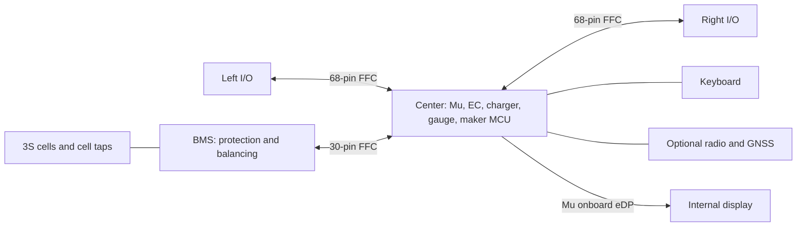

# Ducktop2

i'm building a 16-inch x86 laptop around the LattePanda Mu. i wanted the
exposed hardware and flexibility of a cyberdeck in something i could
actually carry around and use every day.

ducktop1 used a Pi 500+ and a portable monitor, with HDMI and USB-C cables
looping around the outside of the case. ducktop2 brings the display onto
direct eDP and puts power, ports, and laptop controls on custom boards.

## what's in it

- LattePanda Mu N305, with a 16 GB RAM target and 64 GB onboard eMMC
- 16-inch AUO B160QAN03.K, targeting 2560x1600 at 120 Hz over direct eDP
- M.2 NVMe and a separate Wi-Fi/Bluetooth socket
- 65-key Cherry MX Ultra Low Profile keyboard and a 140 x 105 mm USB trackpad
- five USB-C ports, two USB-A ports, HDMI, and Gigabit Ethernet
- a 3S battery, USB-C PD charging from either side, and AUX/DC input
- STM32F407 for laptop control and a separate RP2350 with protected maker GPIO
- two status OLEDs, speakers, a headphone jack, and a microphone
- optional VHF/UHF radio, GNSS, and a separate radio audio path

## build status

the four-layer BMS routing was checked on 6 september 2026, with
zero routing errors or unconnected items. schematic ERC is clean,
and the connected pads match the schematic. the power paths, shunt pickups,
reference grounds, and connector current sharing have been reviewed.
protection and thermal testing still need assembled hardware. the center
and I/O boards are eight layers and still need routing. the
[center review](docs/hardware/center-board.md) was updated on 7 september:
the BMS cutout, component placement, M.2 card clearances, wired connectors,
and routing rules are in place. USB pairs now have usable P/N names, and
the existing left-board copper is preserved for the routing pass. the
keyboard has a
rev A production package, and the radio is still a placement board.

the replacement panel has run at 2560x1600 and 120 Hz on the Intehill
controller. the final Mu-to-panel harness still needs its own validation.
firmware has host-tested policy/driver code and an incomplete target port.
the complete laptop is not ready for fabrication or powered integration.

## boards

```mermaid
flowchart LR
    L[Left I/O] <-->|68-pin FFC| C[Center: Mu, EC, charger, gauge, maker MCU]
    C <-->|68-pin FFC| R[Right I/O]
    B[BMS: protection and balancing] <-->|30-pin FFC| C
    Cells[3S cells and cell taps] --- B
    C --- K[Keyboard]
    C --- Radio[Optional radio and GNSS]
    C -->|Mu onboard eDP| Panel[Internal display]
```

the center charges the whole pack. the BMS monitors the cell taps and
balances cells locally. the EC and maker controller have separate jobs,
and the rest of the laptop is intended to work with the radio board removed.

## open in KiCad

the current reference version is KiCad 10.0.4.

| Work | File |
| --- | --- |
| Center schematic | `ducktop2.kicad_pro` |
| Center layout | `ducktop2-center.kicad_pcb` |
| Left I/O | `left_io/left_io.kicad_pro` |
| Right I/O | `right_io/right_io.kicad_pro` |
| BMS | `bms/bms.kicad_pro` |
| Keyboard | `keyboard/12_keyboard_daughterboard.kicad_pro` |
| Radio | `radio_daughterboard/radio_daughterboard.kicad_pro` |

read [build and verification](docs/build-and-verify.md) before regenerating
or syncing a board. the center schematic and PCB have different basenames.
review an explicit current netlist before updating the PCB; rebuilding a
board can replace existing routing.

## files and documentation

| Location | Contents |
| --- | --- |
| Root KiCad files | Center project and active schematic hierarchy |
| `left_io/`, `right_io/`, `bms/`, `keyboard/`, `radio_daughterboard/` | Separate board projects |
| `gen/` | Schematic generators, validation code, and symbol definitions |
| `ducktop2.pretty/`, `Module_LattePanda.pretty/`, `ducktop2.3dshapes/` | Shared footprints and models |
| `docs/hardware/` | Circuit, cable, display, and mechanical documentation |
| `firmware/` | EC/maker code, tests, and firmware release records |
| `mechanical/` | Current floorplan and layout planner |
| `reference/` | Source/reference designs and retained generator inputs |
| `manufacturing/` | Board packages, quotes, and manufacturing requirements |
| `verification/` | Hardware validation record and ignored generated checks |
| `software/` | Fedora setup, recovery, and theme files |

- [hardware and behavior](docs/hardware/overview.md)
- [power and battery](docs/hardware/power-and-battery.md)
- [cables and connectors](docs/hardware/cables-and-connectors.md)
- [display harness](docs/hardware/display-direct-edp.md)
- [mechanical layout](docs/hardware/mechanical.md)
- [build and verify](docs/build-and-verify.md)
- [bring-up procedure](docs/BRINGUP_TEST_PLAN.md)
- [parts and cost](docs/bom-and-cost.md)
- [firmware](firmware/README.md)
- [manufacturing](manufacturing/README.md)
- [OS work](software/os-theme/README.md)
- [ducktop1](docs/ducktop1.md)
- [Forge project pitch](docs/forgery_pitch.md)

## license

the project files are under the [MIT license](LICENSE).
