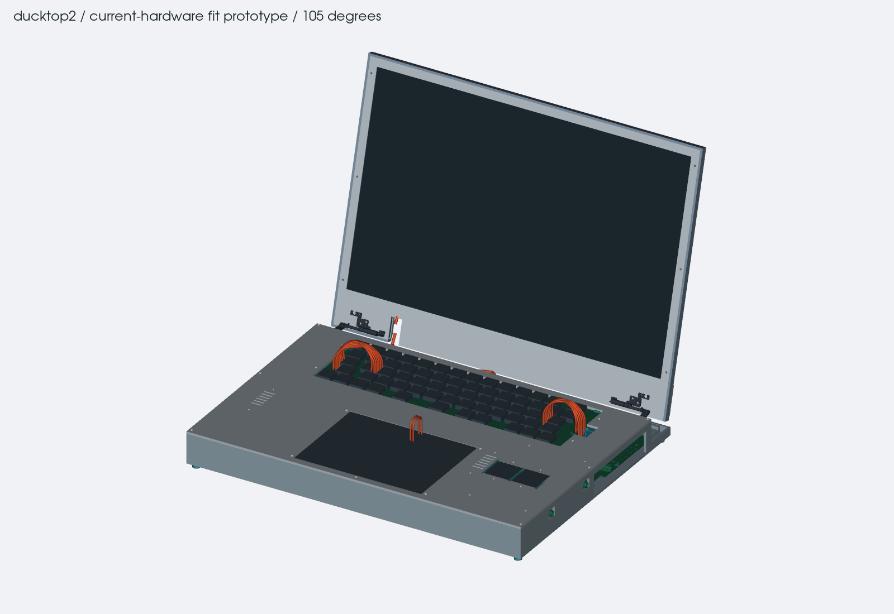
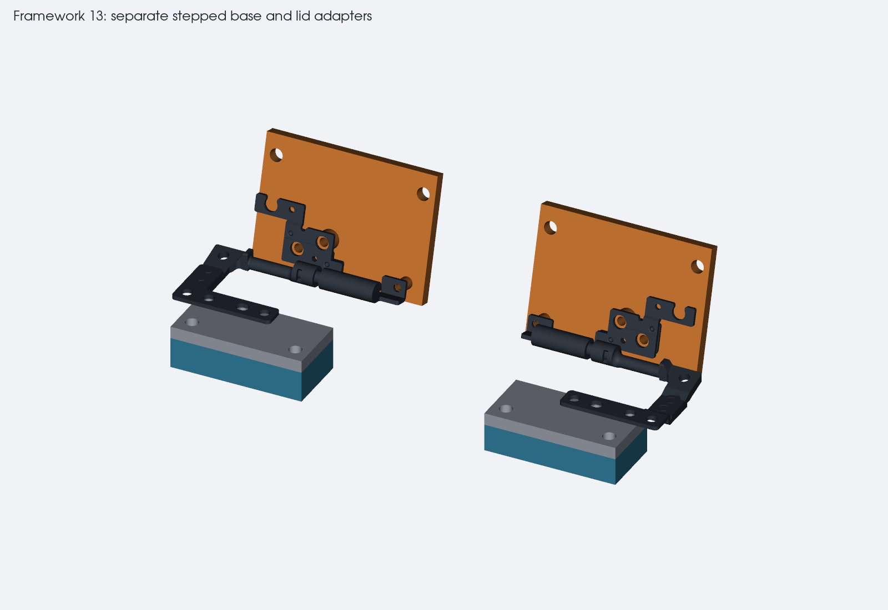

# case prototype

editable CadQuery geometry for the first case fit study. `assembly.json`
selects the 35 mm compact study. the final thickness is still undecided. the current power connectors and wires
still conflict with it and remain visible in the CAD. the 73 mm
`current-hardware` profile is a clearance reference, not the enclosure
target. PCB files are read, never saved by these scripts.

the exports use the earlier PCB snapshots. the new power connector revision
has not been regenerated in the case yet.

open `inspection.html` for the interactive CAD view and `packaging.md` for
the height stack, exact conflicts, assembly order and measurement list.
the case is not ready for manufacture.

start with `hinge-fit.md`, `hinge-datums.json` and the drawings. the first
small prints are under `exports/hinge-tests/`. the retained Framework models
and drawings include their source revision, hashes, copyright and license.

from the repo root:

```sh
/Applications/KiCad/KiCad.app/Contents/Frameworks/Python.framework/Versions/Current/bin/python3 mechanical/case-prototype/inventory_boards.py
.workbench/layout-env/bin/python mechanical/case-prototype/hinges.py
.workbench/layout-env/bin/python mechanical/case-prototype/check_hinges.py
.workbench/layout-env/bin/python mechanical/case-prototype/draw_hinges.py
.workbench/layout-env/bin/python mechanical/case-prototype/export_pcbs.py
.workbench/layout-env/bin/python mechanical/case-prototype/build.py --profile compact-study
.workbench/layout-env/bin/python mechanical/case-prototype/check_exports.py
.workbench/layout-env/bin/python mechanical/case-prototype/finalize_metadata.py
.workbench/layout-env/bin/python mechanical/case-prototype/sync_floorplan.py
```

use `--profile current-hardware` to inspect the taller saved-hardware
reference. both configurations rebuild the same stable output paths; there
is one source tree. `--no-render` skips PNGs but still exports CAD and runs
the geometry review. refreshing board data is a deliberate step: inspect
PCB drift and revised outlines/mounts before adopting new electronics.

## files

- `build.py`, `cad.py`, `hinges.py`, `cables.py`, `assembly.json`: editable
  parametric source and both case configurations.
- `exports/ducktop2-assembly.step`: named assembly in the documented XY/Z
  frame, shown open at 105 degrees. the source and viewer supply other poses.
- `exports/parts/`: separate manufactured STEP parts and print derivatives.
  large metal reinforcement parts also have split, fit-only STLs. those
  fragments do not replace the continuous metal load path.
- `exports/hinge-tests/`, `drawings/`: inexpensive hinge gauges and
  dimensioned mounting details. start here before printing the full base.
- `mounting-schedule.csv`, `parts.json`: reference/XYZ/thread/fastener/
  insulation/status schedule and part inventory.
- `assembly-checks.json`, `hinge-checks.json`, `cable-checks.json`,
  `component-coverage.json`: distinct geometry, motion and cable results.
- `views/`: actual-CAD open, closed, exploded, internal, hinge and section
  images. visible wire intrusions in the compact view are unresolved clashes.

the existing environment uses CadQuery 2.8.0 and VTK. keep `cad.py` and
`hinges.py` together. changing a parameter and rerunning rebuilds solids,
STEP, STL and the actual-CAD view. meshes are print derivatives, not the
editable source. all exported STEP coordinates are millimeters, installed
X/Y with front +Y and Z positive down from the base bottom. the renderer
uses the same geometry in a conventional Z-up view, related by a rotation.

the original 3.3 kg kit is selected. its drawing label matches, but the
owned hinges still need the coupon fit and marking check. the panel, cell
and trackpad measurements remain outstanding. the planned full enclosure
uses separate load paths for the lid, keyboard, trackpad and batteries.




