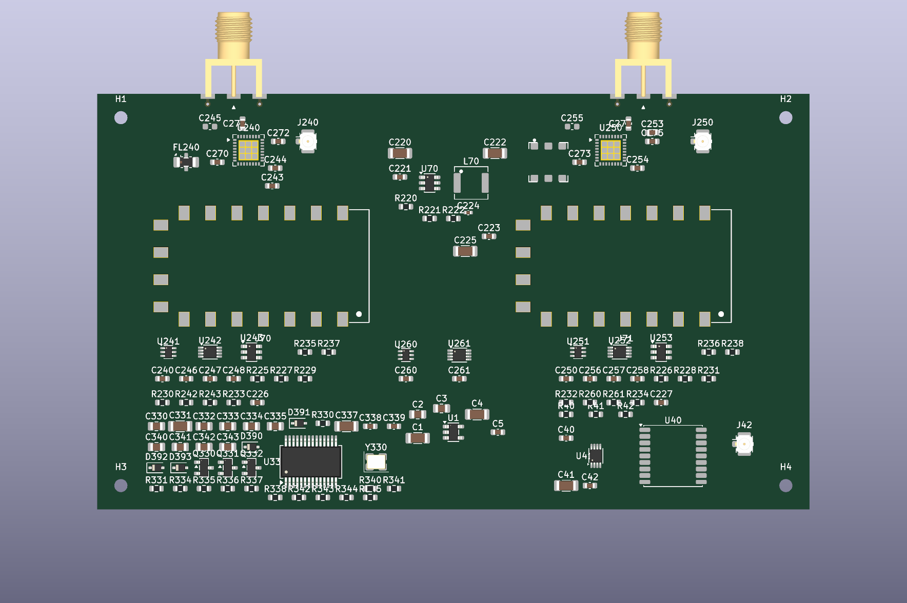

# Ducktop2 Radio Daughterboard

This is the removable radio, GNSS, and radio-audio section of Ducktop2. Keeping
it separate means the main laptop can still boot, charge, play system audio,
use its microphone, and run normally if the radio board is not installed or
needs another revision.



The board contains:

- DRA818V and DRA818U FM radio modules;
- external low-pass filtering and selectable onboard/external antenna paths;
- a u-blox MAX-M10S GNSS receiver;
- a separate PCM2900C USB codec for radio audio; and
- default-off power, USB, UART, I2C, PTT, and status interfaces to the mainboard.

The fixed laptop audio codec and microphone remain on the mainboard. The radio
codec is on the second port of the internal USB hub and has separately switched
VBUS and data, so removing this board does not remove system audio.

## Generate And Verify

The KiCad hierarchy and placement board are generated from `gen/`:

```sh
python3 gen/generate_radio_daughterboard_project.py
python3 gen/generate_radio_daughterboard_pcb.py
python3 gen/verify_radio_daughterboard.py
```

Current verification result:

- ERC: 0 errors, 0 warnings
- board contracts: pass
- placed footprints: 126
- unrouted connections: 385
- classified placement warnings: 96

The PNG files are placement-stage renders of the current board.
